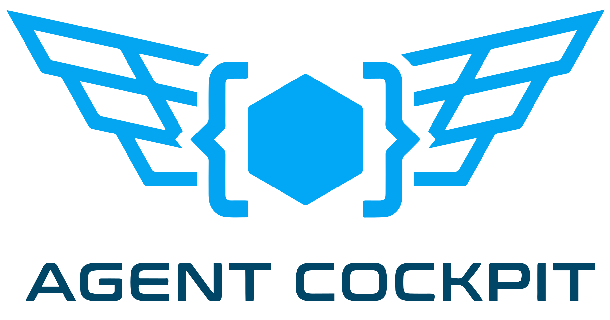

<p align="center">
  
</p>

<p align="center">
  A unified web interface for AI coding agents. Own your data, switch between providers freely.
</p>

---

## Why Agent Cockpit?

When you use vendor-hosted AI interfaces — Anthropic's Claude, Amazon's Kiro, Google's Gemini, OpenAI's ChatGPT — each one builds up memory and context about you: your preferences, your codebase knowledge, your working style. That memory is locked inside their platform. If a better model comes along from another provider, you can't take your conversation history, accumulated context, or customizations with you. You end up explaining yourself from scratch.

Agent Cockpit solves this by decoupling **your data** from **the AI provider**. It sits on your machine, talks to CLI-based coding agents, and keeps all conversations, sessions, and context locally on disk in open JSON files. When you switch to a different CLI backend, the new agent can access everything the previous one built up. Your investment in AI-assisted workflows stays with you, not with a vendor.

## Supported Backends

| Backend | CLI | Status |
|---------|-----|--------|
| **Claude Code** | `claude` | Fully supported |
| **Kiro** | `kiro-cli` | Fully supported |

Switch between backends per-conversation using the dropdown in the chat input area. Your selected backend is remembered for new conversations.

## How It Works

Agent Cockpit runs on the same machine as your CLI tools. When you send a message through the browser, the server spawns a CLI process locally, streams the response back over WebSocket, and stores the conversation as a JSON file on disk. The CLI runs with full access to your local filesystem and tools, just as it would in your terminal.

This means:
- **The CLI and the web interface must run on the same machine.** Agent Cockpit spawns local processes, not remote API calls.
- **Expose the server for remote access.** Use a tunnel like [Cloudflare Tunnel](https://developers.cloudflare.com/cloudflare-one/connections/connect-networks/) to chat with your coding agents from any browser, anywhere, while they operate on your local files and environment.
- **OAuth protects access.** Only the email addresses you configure in `ALLOWED_EMAIL` can log in, so your CLI sessions stay private even when exposed over the internet.

## Features

- **Multi-backend support** — switch between Claude Code and Kiro (or any future backend) per-conversation from a single interface
- **Real-time streaming** — responses stream live via WebSocket as the CLI generates them, with automatic reconnection and state recovery
- **Agent & tool visualization** — see sub-agents, tool calls, thinking, and outcomes in real-time with grouped activity panels
- **Multi-workspace support** — conversations are organized by workspace directory, each with its own instruction set
- **Per-workspace instructions** — customize the system prompt for each project directory
- **Conversation management** — create, rename, search, archive, and delete conversations grouped by workspace
- **Session management** — reset CLI sessions, view session history with LLM-generated summaries, download session archives as Markdown
- **Auto-generated titles** — conversation titles are automatically generated from the first message
- **File uploads** — drag-and-drop, paste from clipboard, or use the attach button with inline image previews
- **Draft persistence** — unsent messages and attached files are preserved when switching conversations
- **Message queue** — queue messages while the CLI is responding; they send automatically when the current response completes
- **Plan mode and interactive questions** — approve plans and answer questions from the CLI directly in the browser
- **Dark and light themes** — system-aware theme with manual override
- **Google and GitHub OAuth** — email whitelist for access control
- **Download conversations** — export entire conversations or individual sessions as Markdown
- **Self-update** — check for updates and apply them from the UI with one click
- **Pluggable backend system** — extensible adapter architecture for adding new CLI backends
- **Graceful shutdown** — clean process cleanup on SIGTERM/SIGINT
- **File-based storage** — conversations, sessions, and settings stored as JSON on disk (no database)

## Prerequisites

- Node.js 18+
- At least one CLI backend installed and authenticated on the same machine:
  - [Claude Code CLI](https://docs.anthropic.com/en/docs/claude-code) (`claude`)
  - [Kiro CLI](https://kiro.dev) (`kiro-cli`)
- At least one OAuth provider configured: Google OAuth 2.0 **or** GitHub OAuth (or both)
- (Optional) [Cloudflare Tunnel](https://developers.cloudflare.com/cloudflare-one/connections/connect-networks/) or a similar tunnel for remote access

## Quick Start

1. Clone the repository and install dependencies:

```bash
git clone https://github.com/daronyondem/agent-cockpit.git
cd agent-cockpit
npm install
```

2. Copy `.env.example` to `.env` and fill in your values:

```bash
cp .env.example .env
```

3. Start the server:

```bash
npm start
```

4. Open `http://localhost:3334` in your browser.

## Environment Variables

| Variable | Required | Default | Description |
|----------|----------|---------|-------------|
| `PORT` | No | `3334` | Server listen port |
| `SESSION_SECRET` | Yes | — | Secret for signing session cookies |
| `GOOGLE_CLIENT_ID` | No* | — | Google OAuth 2.0 client ID |
| `GOOGLE_CLIENT_SECRET` | No* | — | Google OAuth 2.0 client secret |
| `GOOGLE_CALLBACK_URL` | No* | — | Google OAuth callback URL |
| `GITHUB_CLIENT_ID` | No* | — | GitHub OAuth client ID |
| `GITHUB_CLIENT_SECRET` | No* | — | GitHub OAuth client secret |
| `GITHUB_CALLBACK_URL` | No* | — | GitHub OAuth callback URL |
| `ALLOWED_EMAIL` | Yes | — | Comma-separated list of allowed email addresses |
| `DEFAULT_WORKSPACE` | No | `~/.openclaw/workspace` | Default working directory for CLI processes |
| `BASE_PATH` | No | `''` | URL base path for reverse proxy deployments |
| `KIRO_ACP_IDLE_TIMEOUT_MS` | No | `600000` | Idle timeout (ms) before killing the Kiro ACP process |

*\* At least one OAuth provider (Google or GitHub) must be fully configured. You can set up one or both.*

## Authentication Setup

You need at least one OAuth provider configured. You can use Google, GitHub, or both.

### Google OAuth

1. Go to the [Google Cloud Console](https://console.cloud.google.com/).
2. Create a new project (or select an existing one).
3. Navigate to **APIs & Services > Credentials**.
4. Click **Create Credentials > OAuth client ID**.
5. Select **Web application** as the application type.
6. Add `http://localhost:3334` to **Authorized JavaScript origins**.
7. Add `http://localhost:3334/auth/google/callback` to **Authorized redirect URIs**.
8. Copy the Client ID and Client Secret into your `.env` file.
9. Set `ALLOWED_EMAIL` to the Google account email you want to grant access.

### GitHub OAuth

1. Go to **GitHub Settings > Developer settings > OAuth Apps > New OAuth App**.
2. Set the **Authorization callback URL** to `http://localhost:3334/auth/github/callback` (or your production URL).
3. After creating the app, copy the Client ID and generate a Client Secret.
4. Add `GITHUB_CLIENT_ID`, `GITHUB_CLIENT_SECRET`, and `GITHUB_CALLBACK_URL` to your `.env`.

## Remote Access with Cloudflare Tunnel

To access Agent Cockpit from outside your local network, use [Cloudflare Tunnel](https://developers.cloudflare.com/cloudflare-one/connections/connect-networks/):

```bash
cloudflared tunnel --url http://localhost:3334
```

Use the tunnel-provided URL to reach your local Agent Cockpit from any device. Make sure to update your OAuth provider's **Authorized JavaScript origins** and **Authorized redirect URIs** to include the tunnel URL.

## Project Structure

```
agent-cockpit/
├── server.ts                 # Express server entry point (TypeScript, run via tsx)
├── src/
│   ├── types/index.ts        # Shared type definitions
│   ├── config/index.ts       # Environment configuration
│   ├── middleware/
│   │   ├── auth.ts           # OAuth strategies, login page, auth routes
│   │   ├── csrf.ts           # CSRF token generation and validation
│   │   └── security.ts       # Helmet CSP configuration
│   ├── routes/chat.ts        # All chat API routes
│   └── services/
│       ├── backends/
│       │   ├── base.ts           # Base adapter interface for CLI backends
│       │   ├── claudeCode.ts     # Claude Code CLI adapter
│       │   ├── kiro.ts           # Kiro CLI adapter (ACP protocol)
│       │   ├── toolUtils.ts      # Shared tool helpers across backends
│       │   └── registry.ts       # Backend registry (pluggable adapter system)
│       ├── chatService.ts    # Conversation CRUD, messages, sessions, workspaces
│       └── updateService.ts  # Self-update: version checking, git pull, PM2 restart
├── public/
│   ├── index.html            # HTML shell
│   ├── js/                   # Frontend ES modules (no build step)
│   └── styles.css            # CSS with light/dark themes
├── test/                     # Jest test suites
└── data/                     # Runtime data (gitignored)
    ├── chat/
    │   ├── workspaces/{hash}/  # Workspace-based conversation storage
    │   │   ├── index.json      # Conversations + session metadata
    │   │   └── {convId}/       # Session files per conversation
    │   ├── artifacts/          # Per-conversation uploaded files
    │   └── settings.json       # User settings
    └── sessions/               # Express session files
```

## Testing

Tests use Jest and run with:

```bash
npm test
```

Tests cover ChatService CRUD/messaging/sessions, backend adapter system (registry, ClaudeCodeAdapter, KiroAdapter, tool utilities), chat route integration (streaming, reconnection, options passthrough), graceful shutdown (SIGINT/SIGTERM), session file-store persistence, draft state persistence, message queuing, and self-update service.

CI runs tests automatically on every pull request against `main` via GitHub Actions. Version bumps are automated on merge to `main`.

## Backend-Specific Notes

### Claude Code CLI

Agent Cockpit spawns Claude Code CLI processes on your behalf. To get the best experience, consider adding these settings to your `~/.claude/settings.json`:

```json
{
  "attribution": {
    "gitCommit": "",
    "pullRequest": ""
  },
  "permissions": {
    "allow": [
      "Edit(**)"
    ]
  }
}
```

- **`attribution.gitCommit: ""`** removes the `Co-Authored-By: Claude` trailer from git commits.
- **`attribution.pullRequest: ""`** removes the Claude attribution from pull request descriptions.
- **`permissions.allow: ["Edit(**)"]`** gives Claude Code permission to edit any file without prompting, useful since Agent Cockpit has no interactive terminal for approvals.

### Kiro CLI

Kiro connects via ACP (Agent Client Protocol) — JSON-RPC 2.0 over stdin/stdout. The adapter handles:
- Lazy process spawning with idle timeout (configurable via `KIRO_ACP_IDLE_TIMEOUT_MS`)
- Automatic session creation, loading, and resume across server restarts
- Sub-agent tracking with grouped tool activity visualization
- Permission auto-approval for all tool calls

Ensure `kiro-cli` is installed and authenticated before selecting Kiro as a backend.

## Adding a New Backend

Agent Cockpit's pluggable adapter system makes it straightforward to add new CLI backends:

1. Create `src/services/backends/myBackend.ts` extending `BaseBackendAdapter`
2. Implement `metadata`, `sendMessage()`, `generateSummary()`, and optionally `generateTitle()`, `shutdown()`, `onSessionReset()`
3. Import shared helpers from `toolUtils.ts` (never import from another adapter)
4. Register in `server.ts` — no other file changes needed

See [SPEC.md](SPEC.md) for the full adapter contract and stream event protocol.

## Roadmap

Agent Cockpit supports Claude Code and Kiro as its first two backends. As vendors release more CLI-based coding agents, Agent Cockpit will add adapters so you can use them all from a single interface while keeping your data portable.

## Specification

See [SPEC.md](SPEC.md) for a complete technical specification covering every API endpoint, data model, frontend behavior, security mechanism, and implementation detail.
