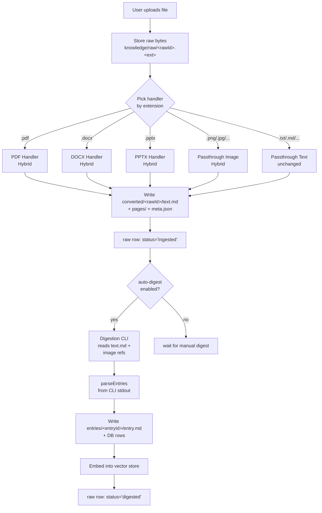
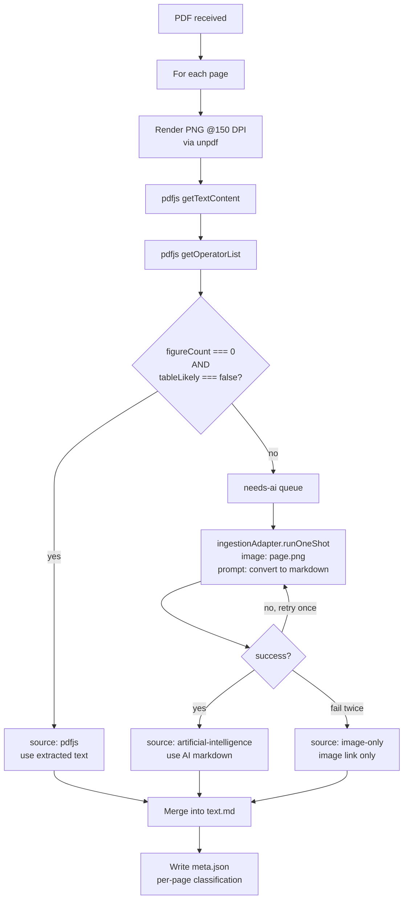
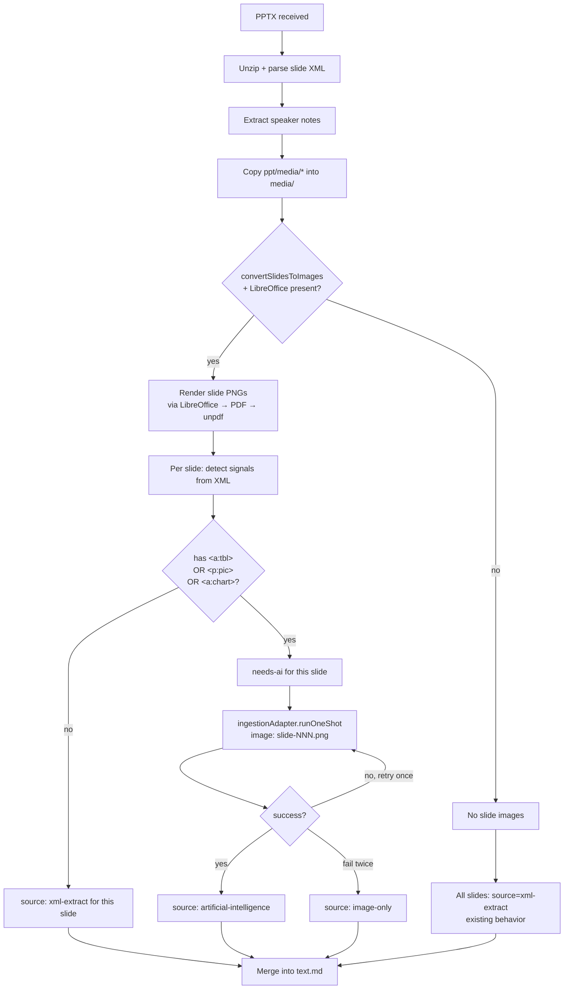
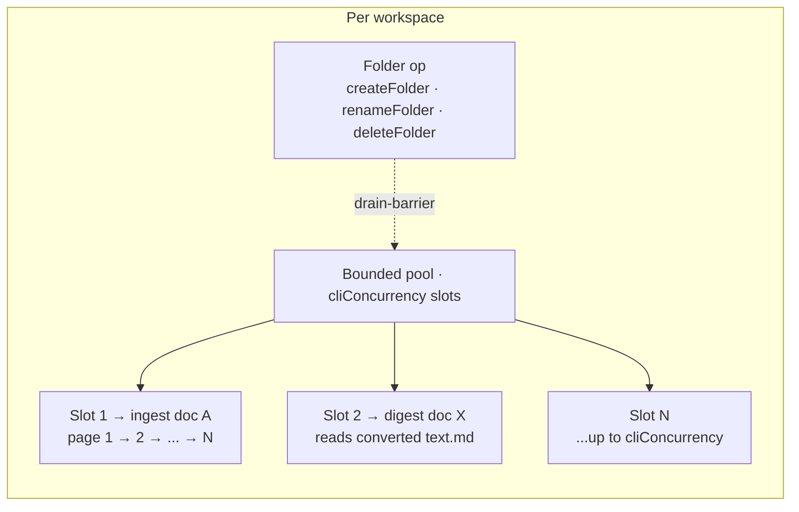
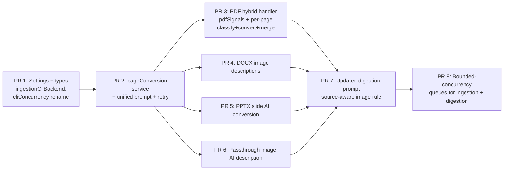

# Design: Hybrid AI-Assisted Knowledge Base Ingestion

[← Back to index](SPEC.md)

| | |
|--|--|
| **Status** | Draft — under design review |
| **Author** | Daron Yondem |
| **Last updated** | 2026-04-26 |
| **Implementation** | Not yet started |

---

## 1. Background & Motivation

The Knowledge Base pipeline today has two failure modes the user has hit in practice:

1. **Vision-only PDFs lose coverage at digestion time.** A 185-page rasterized PDF (`Agentic Artificial Intelligence`) produced only **20 entries** when run through digestion. The handler converts every PDF page to a 150 DPI PNG and writes a thin `text.md` index of `` links — there is no extracted text. The Digestion CLI is then asked, in **a single call**, to read 185 page images and emit structured entries. Output token budget pressure pushes the CLI toward "summarize and merge" rather than "one entry per concept."
2. **Per-format quality varies dramatically.** PDFs are 100% image (great fidelity, poor accessibility for the CLI). PPTX text is XML-extracted (loses table structure, ignores chart content). DOCX is high-quality pandoc output (tables preserved) but embedded image content is just a link with no description. Passthrough images are stored as-is with no description at all. The same digestion pass has to cope with very different input qualities.

The root cause in both cases is that **the only intelligent step in ingestion is digestion**, which has to do everything — read images, recognize tables, describe figures, *and* produce structured entries — in one shot.

This design moves intelligence earlier: a separate **Ingestion CLI** converts visual content (PDF pages, slide images, embedded DOCX figures, standalone uploaded images) into clean Markdown at ingest time, so digestion sees real text instead of image links, and the document's tables/figures/diagrams are captured as structured Markdown rather than buried in pixels.

## 2. Goals & Non-Goals

**Goals**

- Convert PDF pages, flagged DOCX images, flagged PPTX slides, and standalone uploaded images to Markdown at ingest time using a configured multimodal CLI.
- Use deterministic extraction (pdfjs / pandoc / XML parsing) where it is reliable; only invoke the AI converter where it actually adds quality.
- Preserve tables as proper Markdown tables, describe figures/charts/diagrams in prose, transcribe visible text accurately.
- Always keep the original page/slide/image as a backup reference in `text.md` so the digestion CLI can verify against ground truth.
- Annotate every page/slide/image block with a `source:` label so digestion knows where the text came from and how authoritative it is.
- Improve digestion coverage as a side effect — when ingestion produces real text, digestion is no longer bottlenecked by a single-call output budget reading 185 images.

**Non-Goals**

- We are **not** removing the existing image rasterization step. Page/slide/embedded images stay on disk as backup references for the CLI.
- We are **not** changing the digestion output format (entries, frontmatter, body remain the same).
- We are **not** introducing OCR as a separate step. AI conversion subsumes OCR for free.
- We are **not** adding cost caps. Quality is the primary objective.

## 3. Pipeline Overview



### Key change vs. today

The hybrid handlers in Stage 2 invoke the new **Ingestion CLI** for visual content that deterministic extraction can't capture cleanly (PDF pages with tables/figures, scanned pages, DOCX informational images, PPTX slides with charts/tables, standalone images). Everything else takes the existing deterministic path. Stage 3 (digestion) is largely unchanged — it just receives much higher-quality input.

## 4. PDF Handler — Hybrid Flow



### Per-page classification rule

```
safe-text  if figureCount === 0 && !tableLikely
needs-ai   otherwise
```

**Signals (computed by pdfjs):**

- `figureCount` — count of `OPS.paintImageXObject` + `OPS.paintInlineImageXObject` operations from `page.getOperatorList()`. Non-zero means the page contains at least one drawn image (figure, photo, diagram, OR — for scanned pages — a single full-page image XObject).
- `tableLikely` — heuristic from `page.getTextContent()`: bucket text items by Y coordinate, check whether rows have consistent column count and tight X-alignment. Imperfect but catches obvious tables.

**Why no character-count threshold?** The figure/table signals already cover the cases that matter. A scanned page is a full-page image XObject so `figureCount > 0` → `needs-ai` (correct). A blank page has no figures, no tables → `safe-text` → pdfjs returns `""` → empty page block in `text.md` (also correct, no false work).

### CLI invocation

- **Sequential within a document.** Pages 1 → 2 → ... → N are processed one at a time. No batching.
- **Across documents:** up to `Settings.knowledgeBase.cliConcurrency` documents are processed in parallel per workspace.
- **One retry on failure.** If `runOneShot` throws or returns malformed output, retry once. Second failure → fall back to `source: image-only` for that page (the image link is preserved).
- **No cost cap.** A 500-page scanned PDF will issue 500 sequential CLI calls. Quality is the priority.

### Output `text.md` structure

```markdown
# filename.pdf

## Page 1
> source: pdfjs | figures: 0 | table-likely: false

The actual extracted body text from this page goes here. Full sentences,
paragraphs, etc. — pdfjs handles this well when the page has no visual
structure.


## Page 2
> source: artificial-intelligence | figures: 2 | table-likely: true

# Detected page heading

Body prose reconstructed by the AI converter.

| Column A | Column B | Column C |
|----------|----------|----------|
| value 1  | value 2  | value 3  |
| value 4  | value 5  | value 6  |

> Figure caption: A bar chart showing quarterly revenue from 2020 to 2024,
> with Q4 2024 reaching $4.2M, the highest of the period.


## Page 3
> source: image-only | note: AI conversion failed after retry


```

The image link is **always** present per page, regardless of source.

## 5. DOCX Handler — Image Description

DOCX handling is largely unchanged for prose: pandoc still produces high-quality GFM with tables intact. The new behavior is **inline AI descriptions for embedded images**.

### Image filter

After pandoc extracts media into `media/`, inspect each image. **Skip images with width < 100px** — these are typically icons, logos, or decorative dividers and don't carry standalone informational value. Describe everything else.

### Per-image AI call

For each image that passes the filter:

```
ingestionAdapter.runOneShot(prompt, { image: <media/foo.png> })
```

Prompt is the **unified image-to-markdown prompt** (see §8). One retry on failure. On second failure: leave the markdown image link as-is, no description added.

### Output augmentation

For described images, augment the existing markdown:

**Before:**
```markdown

```

**After:**
```markdown


> Image description (source: artificial-intelligence): A line chart showing
> daily active users from January through March 2026, with peak DAU of
> 12,400 on March 17. The trend shows steady week-over-week growth of
> approximately 3%.
```

The image link is preserved. Description is appended as a quoted block so it's visually distinct in the rendered markdown.

## 6. PPTX Handler — Slide AI Conversion

PPTX has the most complex flow because the existing path already extracts text from XML and *optionally* rasterizes slides via LibreOffice (`Settings.knowledgeBase.convertSlidesToImages`).

### Per-slide flow



### Signal detection from slide XML

For each `ppt/slides/slideN.xml`:

- Contains `<a:tbl>` → `tableLikely = true`
- Contains `<p:pic>` references → `figureCount++`
- Contains `<a:chart>` references → `figureCount++` (charts are particularly important — XML extraction loses chart data entirely)
- Pure bullet/text slide → `safe-text`

### AI conversion gating

The AI conversion path **requires** slide images to send to the CLI. If `convertSlidesToImages` is off or LibreOffice is not present:
- All slides take the existing XML-extract path with no AI augmentation.
- `text.md` reflects this with `source: xml-extract` annotations.
- Settings UI should make this dependency explicit (e.g. *"AI conversion for slides requires LibreOffice + 'Convert slides to images' enabled"*).

### Output `text.md` structure

```markdown
# deck.pptx

## Slide 1
> source: xml-extract | figures: 0 | table-likely: false

- Bullet point 1
- Bullet point 2

### Speaker Notes

Speaker notes content here.


## Slide 2
> source: artificial-intelligence | figures: 1 | table-likely: true

# Quarterly Results

| Quarter | Revenue | Growth |
|---------|---------|--------|
| Q1 2026 | $2.1M   | +12%   |
| Q2 2026 | $2.4M   | +14%   |

> Figure description: Pie chart showing market share — 42% Product A,
> 31% Product B, 27% Product C.

### Speaker Notes

Speaker notes content here.


```

## 7. Passthrough Image Handler — AI Description

Standalone images currently get only the bare image reference. The new behavior:

- Copy file to `media/` (existing).
- **NEW** — sequential `ingestionAdapter.runOneShot` with the image and the unified image-to-markdown prompt.
- One retry on failure. Second failure → fall back to current behavior (image link only).

### Output `text.md` structure

```markdown
# screenshot.png

> source: artificial-intelligence

# Detected heading from the image

Prose description of what the image contains. Any visible text is
transcribed. If the image contains a chart or diagram, the structure
and data are described.


```

## 8. Unified Image-to-Markdown Prompt

Used for **all four AI conversion call sites** (PDF page, DOCX flagged image, PPTX flagged slide, passthrough image upload):

```
Convert this image to clean Markdown.

- Preserve any tables as proper Markdown tables (`| col | col |`).
- For figures, charts, diagrams, photos, or other visual content: describe
  what they show in 1–3 sentences of prose. If they include data points or
  labels, capture those.
- Transcribe any visible text accurately.
- Preserve page-level structure: detect headings and use `#`, `##`, `###`.
  Detect lists and use `-` or `1.`.
- Include captions or labels that accompany figures/tables.
- Output Markdown only. No preamble, no explanation, no code fences around
  the result.
```

One prompt for every call site. The prompt does not assume a specific source format — page, slide, embedded figure, standalone image all work the same way.

## 9. Updated Digestion Prompt

The digestion prompt's image-reference rule (added in PR #207) is replaced with a more nuanced rule that respects the new `source:` annotations:

```
Each `## Page N` (or `## Slide N`) section is annotated with a `source:`
line indicating where its content came from:

- `source: pdfjs` (PDFs) or `source: xml-extract` (PPTX) — text was
  deterministically extracted; the page/slide image link is provided as
  backup. Consult the image only when the text seems incomplete,
  contradictory, or references a visual element you can't see in the
  markdown.

- `source: artificial-intelligence` — markdown was reconstructed from the
  page/slide image by a multimodal AI converter at ingest time, which has
  already captured tables and figure descriptions. The markdown is your
  primary source. Open the image directly to verify a specific table cell,
  figure detail, or layout when accuracy matters.

- `source: image-only` — no text was extractable and AI conversion failed
  after retry. The image IS the content and you MUST open and analyze it
  using your Read tool.

Image paths are relative to the converted text file's directory. Use Read.
```

## 10. Settings & Configuration

### New settings (`Settings.knowledgeBase`)

```typescript
{
  // NEW — Ingestion CLI for AI-assisted page/slide/image conversion
  ingestionCliBackend?: string;     // backend ID (e.g. 'claude-code', 'codex')
  ingestionCliModel?: string;       // model ID (must be vision-capable)
  ingestionCliEffort?: string;      // effort level

  // RENAMED — was `dreamingConcurrency`, now applies to all three pipelines
  cliConcurrency?: number;          // default 2

  // existing settings unchanged ...
  digestionCliBackend, digestionCliModel, digestionCliEffort,
  dreamingCliBackend,  dreamingCliModel,  dreamingCliEffort,
  convertSlidesToImages,
}
```

### Behavior when `ingestionCliBackend` is unset

- PDF: handler degrades gracefully — runs pdfjs text extraction for `safe-text` pages, but `needs-ai` pages fall back to `source: image-only` (image link only, no text). This is strictly better than today (today gets nothing for any page).
- DOCX: pandoc still produces clean markdown; embedded images stay as bare links (current behavior).
- PPTX: XML extraction still runs; slides are rasterized if `convertSlidesToImages` is on but no AI conversion happens.
- Passthrough image: image link only (current behavior).

The system never blocks ingestion on the Ingestion CLI being unconfigured. It just delivers lower-quality output.

### Settings screen changes

- New **Ingestion CLI** block above the existing Digestion CLI block, with the same backend/model/effort dropdowns. Note that this CLI must be vision-capable.
- The concurrency slider (currently labeled "Dreaming concurrency") moves to a top-level section labeled **"Pipeline concurrency"** with a description like *"Number of documents processed in parallel by ingestion, digestion, and dreaming CLIs per workspace."*

### Migration

On settings load:
- If `dreamingConcurrency` exists and `cliConcurrency` does not, copy `dreamingConcurrency` → `cliConcurrency`.
- Future writes use `cliConcurrency` only.
- `dreamingConcurrency` is left in place for one release cycle for safety, then removed.

## 11. Concurrency Model



- **Within a single document:** sequential. PDF pages, PPTX slides, DOCX flagged images all process one at a time per document.
- **Across documents:** up to `cliConcurrency` documents run in parallel per workspace.
- **Shared budget across pipelines.** `cliConcurrency` is a *single* budget across ingestion + digestion combined for the same workspace — both services hold a reference to the same `WorkspaceTaskQueue` instance. So with `cliConcurrency = 2`, the workspace can have 2 ingestions, or 1 ingestion + 1 digestion, or 2 digestions in flight — never 3 of any combination. Dreaming runs against its own session-driven runner (it already uses `cliConcurrency` for its synthesis batches) and stays independent.
- **Folder ops are drain barriers.** `createFolder` / `renameFolder` / `deleteFolder` mutate shared structure (`raw_locations` rows reference folder paths) and must not race against in-flight ingestions. When a folder op is dispatched, the queue: (1) stops accepting new work into running slots, (2) waits for all in-flight tasks to settle, (3) runs the folder op alone, (4) resumes normal dispatch. Coarse pause is fine because folder ops are rare manual UI actions; fine-grained per-row locking would be over-engineered.
- Today's per-workspace FIFO (effective concurrency = 1) is replaced with this bounded-concurrency pool with drain-barrier support. The `KbDreamingService` already uses a chunked-parallel pattern; `KbIngestionService` and `KbDigestionService` are reworked to share a single `WorkspaceTaskQueue` instance.

## 12. `meta.json` Schema Changes

Each handler's `meta.json` gains a `pages` (or `slides` / `images`) array with per-unit classification:

```json
{
  "rawId": "c5fa98f7b7ef3532",
  "filename": "book.pdf",
  "handler": "pdf/rasterized-hybrid",
  "convertedAt": "2026-04-26T17:15:25.234Z",
  "metadata": {
    "pageCount": 185,
    "renderedPageCount": 185,
    "rasterDpi": 150,
    "sourceCounts": {
      "pdfjs": 142,
      "artificial-intelligence": 38,
      "image-only": 5
    }
  },
  "pages": [
    {
      "pageNumber": 1,
      "source": "pdfjs",
      "figureCount": 0,
      "tableLikely": false,
      "extractedChars": 1432,
      "aiCallDurationMs": null,
      "aiRetries": 0
    },
    {
      "pageNumber": 42,
      "source": "artificial-intelligence",
      "figureCount": 2,
      "tableLikely": true,
      "extractedChars": 84,
      "aiCallDurationMs": 7340,
      "aiRetries": 0
    }
  ]
}
```

This gives observability for tuning heuristic thresholds and debugging coverage issues retroactively.

## 13. Failure Modes & Error Classes

| Stage | Failure | Behavior |
|-------|---------|----------|
| pdfjs `getTextContent()` throws on a page | Treat as `needs-ai` for that page | (the AI converter can read scanned/corrupt pages too) |
| pdfjs `getOperatorList()` throws | Treat as `needs-ai` (conservative — assume page has structure) | Logged as warning |
| `ingestionAdapter.runOneShot` throws | Retry once | New error class `ingestion_cli_error` if used |
| AI returns empty / malformed output | Retry once | After retry → `source: image-only` |
| AI fails twice on a page | Fall back to `source: image-only` for that page | Substep emits warning |
| Ingestion CLI unconfigured | All `needs-ai` pages → `source: image-only` | No error; degrades gracefully |
| LibreOffice missing for PPTX (with `convertSlidesToImages` on) | Slide images skipped; all slides → `source: xml-extract` | Existing behavior unchanged |

A new `KbErrorClass` value `ingestion_cli_error` is added for unrecoverable Ingestion CLI failures (e.g. CLI process can't spawn, timeout, etc.). This is distinct from `cli_error` which remains a digestion-only class.

## 14. Architecture Changes

### New components

- **`src/services/knowledgeBase/ingestion/pageConversion.ts`** — wraps the per-image AI call with retry logic. Single entry point: `convertImageToMarkdown(imagePath, opts) → string`. Used by all four handlers.
- **`src/services/knowledgeBase/ingestion/pdfSignals.ts`** — pdfjs-based text extraction + signal detection per page. Returns `{ extractedText, figureCount, tableLikely, extractedChars }`.

### Modified components

- **`src/services/knowledgeBase/handlers/pdf.ts`** — restructured around the per-page classify+convert+merge flow. Renames its handler tag from `pdf/rasterized` to `pdf/rasterized-hybrid` so existing entries can be re-digested cleanly if needed.
- **`src/services/knowledgeBase/handlers/docx.ts`** — adds the post-pandoc image-description loop.
- **`src/services/knowledgeBase/handlers/pptx.ts`** — adds slide signal detection and per-slide AI conversion (gated on `convertSlidesToImages`).
- **`src/services/knowledgeBase/handlers/passthrough.ts`** — image branch adds AI description. Text branch unchanged.
- **`src/services/knowledgeBase/handlers/types.ts`** — `HandlerInput` gains an optional `ingestionAdapter?: BaseBackendAdapter` field. Handlers that don't use it (passthrough text) ignore it.
- **`src/services/knowledgeBase/ingestion.ts`** — orchestrator resolves the configured Ingestion CLI from settings before dispatching to the handler. Adds new substeps `"Probing pages…"` and `"Converting flagged page N/M…"`. Reworks the FIFO queue to a bounded-concurrency pool that reads `cliConcurrency`.
- **`src/services/knowledgeBase/digest.ts`** — `buildDigestPrompt` updates the image-reference rule per §9.
- **`src/services/knowledgeBase/dreaming.ts`** — concurrency setting renamed in code from `dreamingConcurrency` to `cliConcurrency`.
- **`src/types/index.ts`** — `Settings.knowledgeBase` schema additions.
- **`public/v2/src/screens/settingsScreen.jsx`** + **`public/js/main.js`** — new Ingestion CLI block + concurrency relocation.

## 15. Implementation Sequence

The work decomposes naturally into PRs that can land independently. Each leaves the system in a usable state.



**PR ordering rationale:**

- PR 1 lays the settings/types foundation so subsequent PRs can read `Settings.knowledgeBase.ingestionCliBackend`.
- PR 2 introduces the shared `pageConversion` service and unified prompt — this is the single dependency for PRs 3-6.
- PRs 3-6 are **independent** and can be parallelized. Each upgrades one handler.
- PR 7 updates the digestion prompt once at least one handler is producing source-annotated output (depends on any of PRs 3-6 landing first).
- PR 8 is concurrency rework — could land any time after PR 1.

## 16. Open Questions

1. **`tableLikely` heuristic threshold tuning.** What X-alignment tolerance and minimum row count should trigger `tableLikely=true`? Empirically tune on a corpus of real PDFs.
2. **DOCX width threshold edge cases.** 100px is the chosen cutoff for "decorative." Are there real-world charts narrower than 100px? Probably rare but worth verifying with a few sample docs.
3. **PPTX without `convertSlidesToImages`.** Should we offer to enable it automatically when an Ingestion CLI is configured, or keep it as a separate user choice? Currently kept separate for clarity, but the dependency is awkward.
4. **AI converter timeout per call.** Current digestion uses 15 min. For per-page conversion, 2-3 min per call seems more appropriate. Make it a setting?
5. **Re-digestion of existing entries.** When this design ships, should existing `pdf/rasterized` raws be auto-reingested under `pdf/rasterized-hybrid` to benefit from the new flow? Or wait for a manual user action?

## 17. Future Work (Out of Scope for This Design)

- **Cost telemetry surfaced in UI.** The `meta.json` per-page classifications give us the data; surfacing it as a workspace-level "this KB used X CLI calls / cost $Y" indicator is a separate effort.
- **Adaptive heuristic tuning.** Use the per-page telemetry to learn better thresholds over time.
- **Layout-aware text extraction.** Replace the current `tableLikely` heuristic with a dedicated layout analyzer (e.g. `pdfjs` text-block clustering) for higher precision. Worth doing only if the simple heuristic shows too many false positives in practice.
- **Streaming AI conversion.** Render+convert pages as they finish rather than rendering-then-converting in two phases. Reduces total wall-clock time for large PDFs but complicates progress reporting.

---

[← Back to index](SPEC.md)
