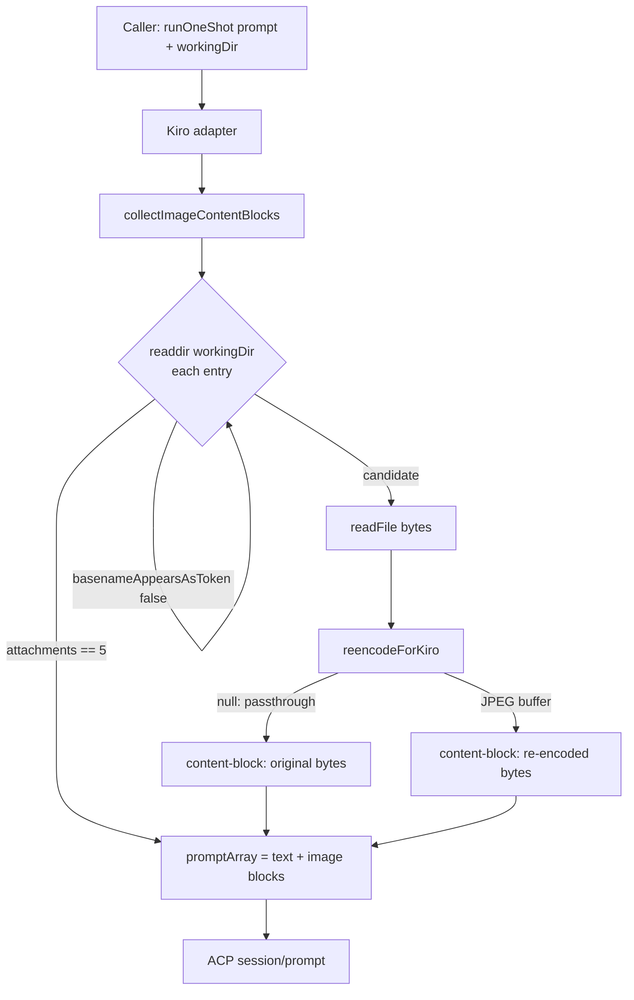

# Kiro/Bedrock vs Claude Code CLI — Opus 4.7 Parity Notes

> **Status:** Living document. Captures empirical findings while integrating the Kiro CLI alongside the Claude Code CLI.
> **Last updated:** 2026-04-27.
> **Scope:** Differences observed between Kiro (which routes Anthropic models through AWS Bedrock) and Claude Code (direct Anthropic API), specifically while exercising Opus 4.7. Findings are sourced from real failures seen in the agent-cockpit ingestion + chat paths.

---

## 1. Why This Document Exists

`agent-cockpit` was originally built around the Claude Code CLI (direct Anthropic API). When the Kiro CLI was added as a second backend ([`src/services/backends/kiro.ts`](../src/services/backends/kiro.ts)), several behaviors that "just worked" in Claude Code broke in Kiro despite both backends nominally exposing Opus 4.7. Every gap below traces to a specific divergence between Anthropic's API and AWS Bedrock's deployment of the same model, or to differences in the CLI transport (Claude Code's pure-stdio newline-JSON stream vs. Kiro's ACP/JSON-RPC channel).

The point of this document is to keep these gotchas catalogued so the next person touching either backend can:

1. Recognize the symptom quickly (failure modes are not always obvious).
2. Trust the existing fix without re-deriving it under pressure.
3. Avoid regressing parity by removing what looks like dead code but is actually a workaround.

---

## 2. Quick Map of Findings

| # | Finding | Affects | Fix landed in |
|---|---------|---------|---------------|
| 1 | Bedrock rejects RGBA PNGs and images > 1568 px long edge | Kiro one-shot + chat | PR #225 |
| 2 | `fs_read` of images base64-inlines bytes into the transcript, blowing the prompt budget | Kiro one-shot (KB ingest) | PR #223 |
| 3 | Filename substring matching attaches sibling files (`foo.png` ↔ `foo.png.ai.png`) | Kiro one-shot (KB ingest) | PR #224 |
| 4 | JSON-RPC errors lose the `data` field, hiding Bedrock's real reason | Kiro adapter (debugging) | PR #225 |
| 5 | Kiro never sends `session/update.turn_end`; the response body's `stopReason` is the real signal | Kiro chat | (initial Kiro adapter) |
| 6 | `session/set_model` is silently ignored on bad input — must race against a timeout | Kiro chat + one-shot | (initial Kiro adapter) |
| 7 | Image attachments are encapsulated inside the adapter so callers (KB ingest, OCR, one-shot) need no API changes | Kiro adapter shape | PR #223 + #224 |

---

## 3. Findings In Detail

### 3.1 Image Format & Dimension Rejection (Bedrock validation)

**Symptom.** Sending an image to Kiro that worked perfectly with Claude Code returns a JSON-RPC `-32603 Internal error: Prompt is too long` or `ValidationException`. Empirically, two input shapes trigger it:

- RGBA PNGs (color type 4 or 6) at any size.
- Any image whose long edge exceeds **1568 px**.

**Root cause.** Bedrock's deployment of Opus 4.7 is stricter than the Anthropic API. The Anthropic-hosted endpoint accepts images up to **2576 px** on the long edge (and accepts RGBA), so KB ingestion's downscaling cap (`MAX_LONG_EDGE_PX = 2576`) is correct for Claude Code. Bedrock has not caught up to that limit, and it rejects PNGs with an alpha channel even when small.

**Fix.** Re-encode any image attached to a Kiro prompt as **JPEG @ quality 92 over a white background**, downscaling so the long edge fits within `KIRO_MAX_LONG_EDGE_PX = 1568`. Both gates are required:

- Empirical testing showed Bedrock rejects RGBA PNG at 2576 px AND at 1568 px, AND rejects RGB JPEG at 2576 px. Only RGB JPEG at 1568 px is accepted.
- JPEG (no alpha channel) covers the alpha gate.
- The downscale + white background covers the dimension gate.

**Code.**

- [`reencodeForKiro()`](../src/services/backends/kiro.ts) — re-encode helper. Returns `null` (caller sends original bytes) when no transform is needed.
- [`pngHasAlpha()`](../src/services/backends/kiro.ts) — detects color type 4/6 by reading the IHDR chunk at fixed offset 25.
- `KIRO_MAX_LONG_EDGE_PX = 1568` — exported, enforced inside `reencodeForKiro`.
- Note: `MAX_LONG_EDGE_PX = 2576` in `src/services/knowledgeBase/ingestion/pageConversion.ts` is correct for Claude Code direct-API and is intentionally **NOT** lowered to match Kiro.

**Ref.** [PR #225](https://github.com/daronyondem/agent-cockpit/pull/225) — `fix(kiro): re-encode RGBA/oversized images for Bedrock + surface ACP error data`.

---

### 3.2 Image Inlining via `fs_read` → Prompt Overflow

**Symptom.** A KB ingestion call asking the Kiro CLI to convert a page image to Markdown fails with `Prompt is too long` even when the image is small (e.g. a 1 MB PNG). The failure occurs *before* the model sees the user prompt.

**Root cause.** Kiro's `fs_read` tool, when used in **Image mode**, base64-inlines the image bytes into the conversation transcript. Once base64-encoded, even a modest image produces tens of thousands of tokens and overflows the upstream model's prompt budget — manifesting as `-32603 Internal error: Prompt is too long`. Claude Code's CLI handles this differently: image references on the prompt are routed via the API's native multipart support and never bloat the textual transcript.

**Fix.** Bypass the `fs_read` path entirely for KB ingestion. When the Kiro adapter receives a `runOneShot()` call where the prompt mentions an image filename (by basename) and that file exists in `workingDir`, the adapter loads the bytes itself, optionally re-encodes them (per finding 3.1), and attaches them as a proper ACP `{type: 'image'}` content block on the `session/prompt` array.

```
session/prompt → prompt: [
  { type: 'text',  text: '<original prompt>' },
  { type: 'image', mimeType: '...', data: '<base64>' },
  ...
]
```

**Cap.** `MAX_IMAGE_ATTACHMENTS = 5` per prompt, to bound worst-case payload size when the prompt happens to mention many filenames.

**Code.**

- [`collectImageContentBlocks(prompt, workingDir)`](../src/services/backends/kiro.ts) — scans `workingDir`, attaches up to 5 images mentioned by basename in `prompt`.
- Wired into the `runOneShot` ACP path: the adapter builds `promptArray = [{type:'text',...}, ...imageBlocks]` before sending `session/prompt`.

**Ref.** [PR #223](https://github.com/daronyondem/agent-cockpit/pull/223) — `fix(kiro): attach image content blocks to ACP session/prompt`.

---

### 3.3 Token-Boundary Filename Matching

**Symptom.** A prompt that says "Convert page-0042.png to Markdown" attaches **both** `page-0042.png` and `page-0042.png.ai.png` to the ACP request, exceeding Kiro's 10 MB attachment cap.

**Root cause.** Filename characters (letters, digits, `.`, `_`, `-`) flow into each other. A naive `prompt.includes(basename)` returns true for `page-0042.png` even when the prompt only mentions the longer `page-0042.png.ai.png` — because the shorter name is a strict substring of the longer one.

**Fix.** Match the basename only when the characters immediately before and after it are NOT filename characters. The check is implemented as a forward scan rather than a regex so we can cleanly detect the substring's neighbors at each occurrence:

```ts
function basenameAppearsAsToken(prompt: string, basename: string): boolean {
  const isFilenameChar = (c: string) => /[A-Za-z0-9._-]/.test(c);
  let from = 0;
  while (true) {
    const idx = prompt.indexOf(basename, from);
    if (idx < 0) return false;
    const before = idx === 0 ? '' : prompt[idx - 1];
    const after  = (idx + basename.length) >= prompt.length ? '' : prompt[idx + basename.length];
    if (!isFilenameChar(before) && !isFilenameChar(after)) return true;
    from = idx + 1;
  }
}
```

**Why it matters in practice.** KB ingestion writes a downscaled `<name>.ai.png` sibling next to oversized images (PR #222). Both files end up on disk in the working directory. Without token-boundary matching the adapter would attach both, and the larger original blew the 10 MB cap.

**Code.** [`basenameAppearsAsToken()`](../src/services/backends/kiro.ts) — used by `collectImageContentBlocks` before reading file bytes.

**Ref.** [PR #224](https://github.com/daronyondem/agent-cockpit/pull/224) — `fix(kiro): require token-boundary match for image basename attach`.

---

### 3.4 JSON-RPC Error Data Extraction

**Symptom.** When a Kiro `session/prompt` fails, the surfaced error is `kiro-cli acp prompt failed: Internal error` — useless. The actual reason (e.g. Bedrock's `ValidationException: image dimensions exceed maximum`) is invisible.

**Root cause.** JSON-RPC error responses are `{ code, message, data }`. The original Kiro adapter only propagated `message`, dropping `code` and `data`. Bedrock packs the meaningful diagnostic (validation error class, model ID, request ID) into `data` and uses a generic `message`.

**Fix.** When the JSON-RPC client receives an error response, attach `code` and `data` to the rejected `Error` (as own properties), then have the adapter format them into the surfaced message:

```ts
const e = err as Error & { code?: number; data?: unknown };
const codePart = typeof e.code === 'number' ? ` [code=${e.code}]` : '';
let dataPart = '';
if (e.data !== undefined) {
  try {
    const dataStr = typeof e.data === 'string' ? e.data : JSON.stringify(e.data);
    dataPart = ` | data: ${dataStr.slice(0, 500)}`;
  } catch {
    dataPart = ' | data: <unstringifiable>';
  }
}
const stderrPart = stderr ? ` | stderr: ${stderr.slice(0, 200)}` : '';
throw new Error(`kiro-cli acp prompt failed: ${e.message}${codePart}${dataPart}${stderrPart}`);
```

**Conventions baked in.**

- `data` is sliced to **500 chars** (full Bedrock JSON would dominate logs).
- `stderr` is sliced to **200 chars** (CLI dumps can be long).
- Format is stable: `<message> [code=N] | data: <json> | stderr: <text>`.

**Code.**

- JSON-RPC client error attach — `AcpClient` message-handling switch in [`src/services/backends/kiro.ts`](../src/services/backends/kiro.ts).
- Caller-side formatting — `runOneShot` and the chat-path `session/prompt` `.catch()` in the same file.

**Ref.** [PR #225](https://github.com/daronyondem/agent-cockpit/pull/225) — same PR as the Bedrock re-encode work, since the two were debugged together.

---

### 3.5 ACP Session/Prompt Stream Termination

**Symptom.** During chat, the UI never shows "done" — Kiro keeps streaming `session/update` notifications and the adapter waits forever.

**Root cause.** The ACP spec lists `sessionUpdate: 'turn_end'` as a valid `session/update` payload. Empirically, **Kiro does not emit it**. Instead, Kiro holds the `session/prompt` JSON-RPC **response** until the turn is fully done — after all subagents, tool calls, permission requests, and streaming chunks complete. The response body's `stopReason` IS the end-of-turn signal.

**Fix.** Treat the response of `session/prompt` as authoritative:

```ts
client.request('session/prompt', { sessionId, prompt }).then((resp) => {
  const stopReason = (resp as { stopReason?: string } | null)?.stopReason;
  console.log(`[kiro] Turn ended session=${sessionId} stopReason=${stopReason}`);
  client.stopNotifications();
}).catch(/* ... see finding 3.4 ... */);
```

The `stopNotifications()` call breaks the `for await (const notification of client.notifications())` loop in the streaming generator. After it exits, the generator yields `{ type: 'done' }`.

**Defensive belt-and-braces.** A `turn_end` handler is still wired up in case Kiro starts emitting it on the ACP channel later. Both paths funnel into the same termination.

**Why this isn't an issue with Claude Code.** Claude Code's CLI uses a different transport (newline-delimited JSON over stdio with explicit `result` events), not JSON-RPC, so the question of "request response vs. notification" doesn't arise.

**Code.**

- One-shot path — the `session/prompt` `.then(stopNotifications)` block in [`src/services/backends/kiro.ts`](../src/services/backends/kiro.ts).
- Chat path — same pattern, plus `stopReason` logging.
- Defensive `turn_end` handler — same file, in the streaming notification switch.

---

### 3.6 Model Probing Timeout

**Symptom.** When a chat is started with a non-default model (e.g. `claude-opus-4.7`), the adapter blocks indefinitely on `session/set_model` if Kiro decides the model isn't available for the session.

**Root cause.** Kiro's ACP server **silently ignores** `session/set_model` (no response, no error) when the `sessionId` is wrong or the model is unsupported. Without a response, the JSON-RPC `pendingRequests` entry never resolves and the `await` never returns.

**Fix.** Race the `session/set_model` request against a 5-second timeout, swallow timeouts, and continue with the default model. In the chat path, surface a user-visible warning:

```ts
try {
  await Promise.race([
    client.request('session/set_model', { sessionId, modelId: model }),
    new Promise((_, reject) => setTimeout(() => reject(new Error('timeout')), 5000)),
  ]);
} catch (err) {
  // one-shot: silent fall-through
  // chat:    yield a `{ type: 'error' }` event explaining the fall-through
}
```

**Why 5 seconds.** Empirically the legitimate `set_model` round-trip is sub-second. 5 s covers a slow ACP startup without keeping the user waiting on a silent ignore.

**Code.** Two call sites in [`src/services/backends/kiro.ts`](../src/services/backends/kiro.ts) — one in `runOneShot` (silent fall-through) and one in the chat streaming path (yields a user-visible warning).

---

### 3.7 Image Attachment Encapsulation

**Finding (architectural).** All of the above image-related handling is encapsulated **inside** the Kiro adapter. Callers — KB ingestion (`runOneShot`), OCR helpers, the chat path — pass plain text prompts and a `workingDir`, exactly the same shape they pass to the Claude Code adapter. They never know about RGBA detection, JPEG re-encoding, basename token matching, the 5-image cap, or the 1568 px dimension cap.

**Why this matters.** Without encapsulation, every caller would need to re-implement Kiro-specific image handling. Worse, future callers (e.g. a fresh KB pipeline stage) would silently send raw images to Kiro and hit the same Bedrock errors over again. By keeping `collectImageContentBlocks` + `reencodeForKiro` adapter-internal, the parity gap is invisible above the adapter boundary.

**Mermaid — image attachment flow (Kiro one-shot path).**



---

## 4. Test Coverage

The following Jest tests in [`test/kiroBackend.test.ts`](../test/kiroBackend.test.ts) lock the parity workarounds in place. Removing or relaxing any of these is a tell that someone is regressing parity:

- `pngHasAlpha` — detects RGBA color type via IHDR offset.
- `reencodeForKiro` — passthrough for in-spec images, downscale + JPEG flatten otherwise.
- `collectImageContentBlocks` — basename token matching, 5-image cap, MIME mapping, re-encode integration.
- `extractKiroToolDetails` — tool-name normalization (separate concern, but in the same suite).
- KiroAdapter metadata — model list pinned (auto + 3 opus + 3 sonnet + haiku + 5 open-weight = 13 entries).

Note: the adapter's streaming behavior (findings 3.5 and 3.6) is not unit-tested end-to-end because `session/prompt` notification streams require a real ACP child process; both behaviors are covered by integration smoke testing during release.

---

## 5. What's NOT in the Adapter

For symmetry, listing what we deliberately **did not** add to the Kiro adapter:

- **No KB-pipeline downscale to 1568 px.** KB ingestion still downscales to `MAX_LONG_EDGE_PX = 2576` because that's correct for Claude Code (the primary backend). The adapter handles the further Kiro-specific 1568 px cap on its own. Lowering KB ingestion would degrade Claude Code quality for no Kiro gain (since the adapter re-downscales anyway).
- **No format-specific allowlist before reading bytes.** `IMAGE_MIME_BY_EXT` lists 5 formats (`.png`, `.jpg`, `.jpeg`, `.gif`, `.webp`); anything else is skipped at the directory-scan stage rather than caught later.
- **No retry on Bedrock validation errors.** If the re-encode + downscale doesn't fix it, retrying with the same input won't either. The error is surfaced verbatim (with `data` payload, finding 3.4) so the user can act on it.

---

## 6. Open Questions

- **Will Bedrock catch up to Anthropic-API limits?** If/when Bedrock starts accepting 2576 px images and RGBA PNGs, `KIRO_MAX_LONG_EDGE_PX` and `pngHasAlpha`/`reencodeForKiro` become dead code. Removing them prematurely re-breaks parity, so they stay until empirically validated.
- **Are non-Anthropic Kiro models (DeepSeek, MiniMax, GLM, Qwen) subject to the same image rules?** Untested. The current adapter applies the same re-encode policy to every model — safe but possibly over-strict.
- **Does Kiro emit `turn_end` for any model?** All testing so far has been against Anthropic-family models. Open-weight models may behave differently.

---

## 7. PR History

| PR | Title | Findings addressed |
|----|-------|--------------------|
| [#220](https://github.com/daronyondem/agent-cockpit/pull/220) | Hybrid passthrough image handler with AI description | (Sets up the KB image flow that surfaced findings 3.1–3.3) |
| [#222](https://github.com/daronyondem/agent-cockpit/pull/222) | Downscale oversized images to a `.ai.png` sibling | (Created the sibling-file naming that surfaced finding 3.3) |
| [#223](https://github.com/daronyondem/agent-cockpit/pull/223) | Attach image content blocks to ACP `session/prompt` | 3.2, 3.7 |
| [#224](https://github.com/daronyondem/agent-cockpit/pull/224) | Require token-boundary match for image basename attach | 3.3 |
| [#225](https://github.com/daronyondem/agent-cockpit/pull/225) | Re-encode RGBA/oversized images for Bedrock + surface ACP error data | 3.1, 3.4 |

Findings 3.5 and 3.6 (stream termination + model probe timeout) predate the issue #211 PR series — they were part of the original Kiro adapter implementation.
