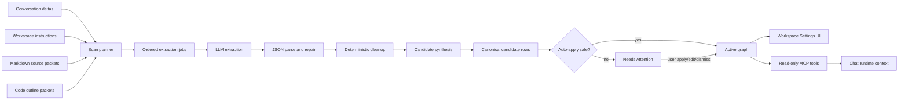
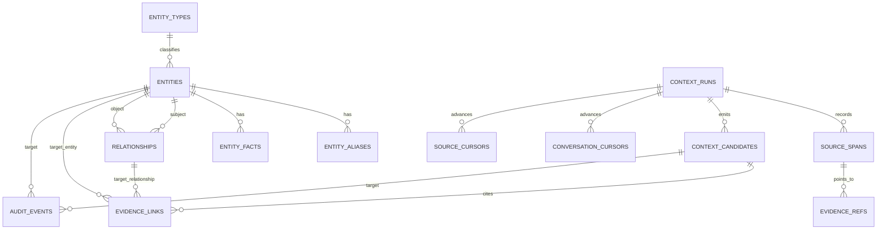
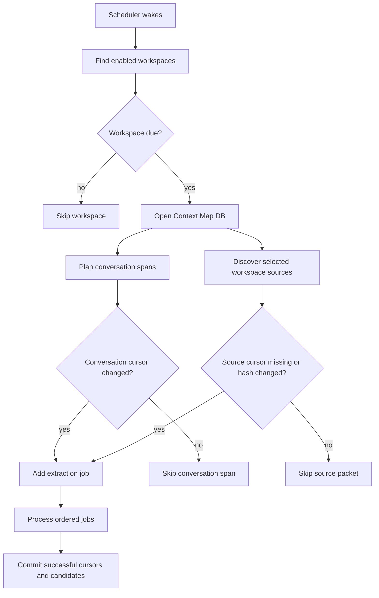
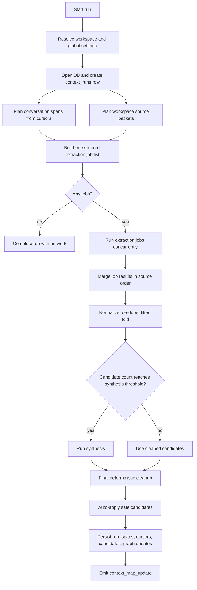
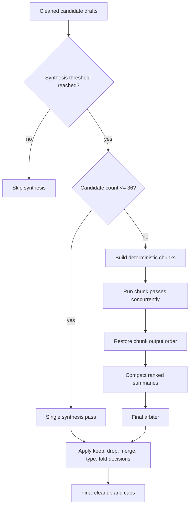
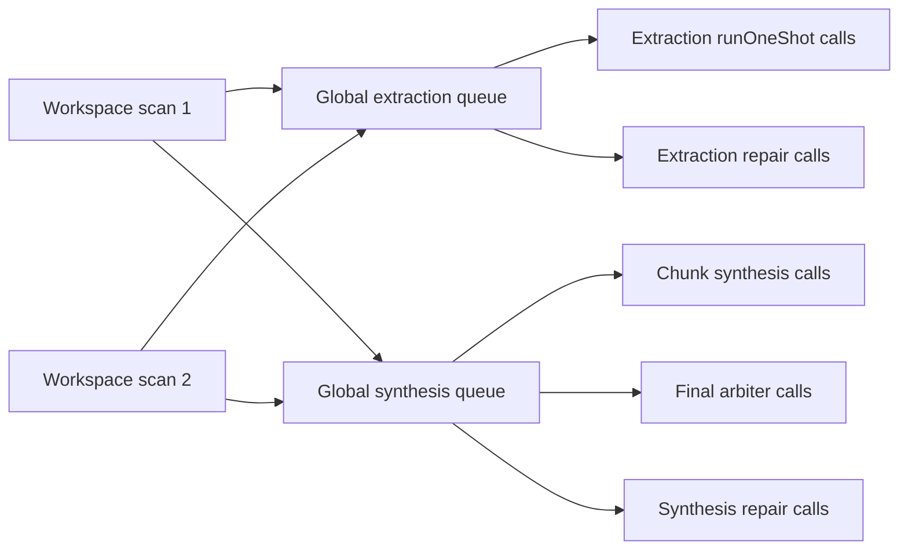
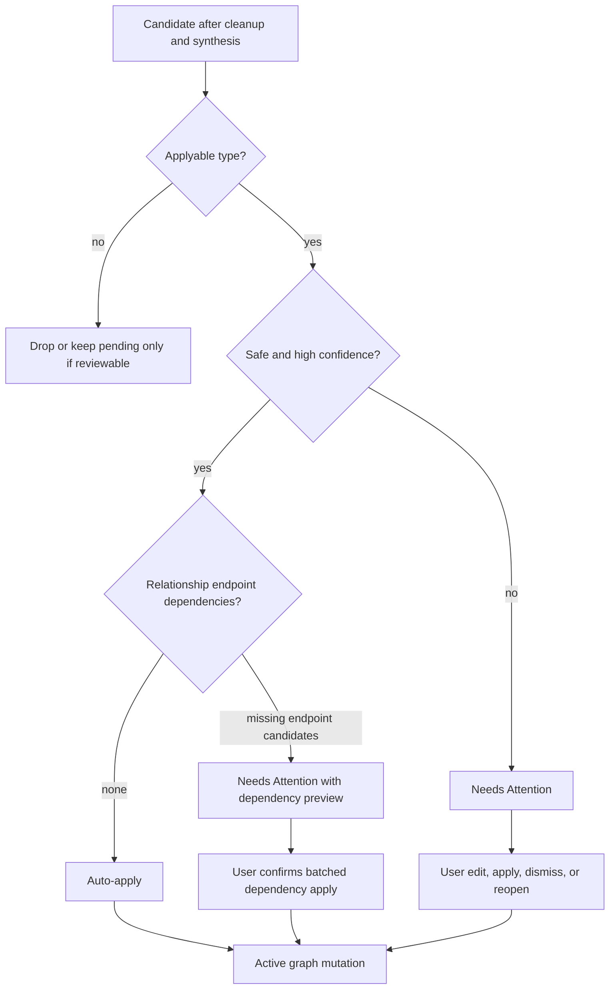
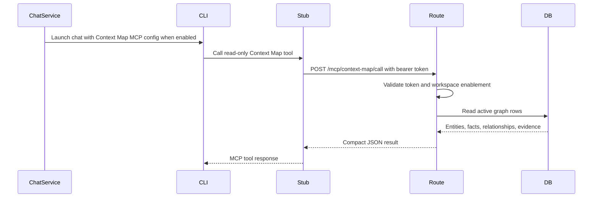

# Context Map Feature Specification

Status: Implemented workspace feature.

Context Map is the workspace-level graph feature that maintains a durable map of important entities, relationships, facts, evidence, processor runs, and pending review items for a workspace. It is designed to work across software repositories, writing workspaces, planning workspaces, research/account workspaces, and other folder shapes without depending on a special workspace directory convention.

This document is the feature-level source of truth. Lower-level implementation details live in:

- [spec-data-models.md](spec-data-models.md#context-map-store-workspaceshashcontext-map)
- [spec-api-endpoints.md](spec-api-endpoints.md)
- [spec-backend-services.md](spec-backend-services.md)
- [spec-frontend.md](spec-frontend.md)
- [spec-testing.md](spec-testing.md)
- [ADR-0044](adr/0044-add-context-map-as-governed-workspace-graph.md), [ADR-0045](adr/0045-scan-workspace-markdown-recursively-for-context-map.md), and [ADR-0046](adr/0046-track-context-map-workspace-source-cursors.md)

The earlier product scope and rationale are preserved in [design-context-map.md](design-context-map.md). That design document explains the ideal product intent; this spec describes the implemented behavior.

## Purpose

Context Map answers:

> What are the important things in this workspace, how are they connected, what evidence supports those conclusions, and what compact context should a runtime retrieve right now?

It is intentionally separate from Memory and Knowledge Base:

- Memory stores durable notes, facts, user preferences, and project context extracted for future sessions.
- Knowledge Base stores ingested source documents, document chunks, topic synthesis, and document-grounded retrieval.
- Context Map stores workspace entities, relationships, evidence pointers, processing state, and governed graph updates.

Context Map does not broadly scan Memory entries or Knowledge Base source documents. Future Memory/KB linkage must be designed as explicit reviewed evidence pointers or targeted lookups, not automatic extraction from those stores.

## Product Boundaries

Context Map is enabled per workspace. It defaults to disabled for new workspaces and is independent of Memory and KB enablement.

When enabled, it runs asynchronously in the background. The active chat CLI does not maintain the graph. The active chat CLI can read the active graph through read-only MCP tools when Context Map is enabled for that workspace.

The feature has one canonical source of truth: `workspaces/{hash}/context-map/state.db`. The UI renders readable cards, modals, and forms from the database. The product does not generate editable Markdown mirrors of the graph.

Disabling Context Map stops any active scan and hides/blocks mutation surfaces, but it does not delete stored Context Map data. Clearing Context Map is a separate destructive action that removes graph, candidate, evidence, run, cursor, and audit rows while preserving workspace enablement/settings and seeded system entity types. Clear is rejected while a scan is active.

## Conceptual Model

### Entity

An entity is a durable named thing that is likely to matter again in the workspace. Examples include a person, organization, project, workflow, document, feature, concept, decision, tool, asset, service, API surface, test suite, content platform, opportunity, or planning theme.

The processor must avoid creating entities for every noun, ordinary filename, local path, source file, root folder, incidental asset, imported package, route string, or one-time mention. Files and paths are normally evidence, not entities.

### Entity Type

The system seeds these built-in entity types:

- `person`
- `organization`
- `project`
- `workflow`
- `document`
- `feature`
- `concept`
- `decision`
- `tool`
- `asset`

The processor can suggest additional workspace-specific entity types through `new_entity_type` candidates, but redundant suggestions for built-in or aliased built-in types are dropped before persistence.

### Fact

A fact is a durable statement attached to an entity. Facts are used when information is useful but does not justify a standalone entity or relationship. Weak relationship evidence can be folded into facts.

### Relationship

A relationship is a typed edge between two entities. Relationship candidates must be evidence-backed and governed. The implementation accepts durable predicates such as ownership, dependency, implementation, documentation, workflow/tool usage, specification, authorship, storage, and related durable work relationships. Comparative, vague, ad-hoc, self-referential, or weak edges are dropped or folded into facts.

### Evidence

Evidence is the source pointer that supports an entity, fact, candidate, or relationship. Evidence can point to conversation message spans, workspace instructions, Markdown source packets, or code-outline packets. Evidence refs store enough information to inspect the source without copying full source bodies into the graph.

### Candidate

A candidate is a proposed graph change emitted by the processor. Candidates are stored before they affect active graph state. Safe high-confidence candidates can be auto-applied. Riskier candidates remain in Needs Attention until a user applies, edits, dismisses, or reopens them.

Implemented candidate types:

- `new_entity_type`
- `new_entity`
- `entity_update`
- `entity_merge`
- `alias_addition`
- `sensitivity_classification`
- `new_relationship`
- `relationship_update`
- `relationship_removal`
- `evidence_link`
- `conflict_flag`

### Context Pack

A context pack is a bounded runtime bundle retrieved from the active graph for a chat CLI. It can include matching entities, related entities, relationships, compact summaries, facts, and evidence pointers. It must not dump the entire graph into the chat context.

## End-to-End Data Flow

The important control points are:

- Extraction jobs are planned in deterministic source order.
- LLM output is parsed, repaired if possible, normalized, and filtered before persistence.
- Synthesis ranks, merges, drops, corrects, and folds candidates before review.
- Only safe candidates auto-apply. Everything else stays reviewable.
- Active graph reads for UI and MCP come from the same SQLite store.

## User-Facing Surfaces

### Global Settings

Global Settings includes a Context Map tab for defaults shared by all workspaces that use global processor mode.

Global settings include:

- Default Context Map CLI profile.
- Optional model and effort overrides.
- Scan interval in minutes. Default: `5`.
- Concurrent Workspace Scans. This controls how many workspace scans the scheduler can run at once. Default: `1`, clamped from `1` to `10`.
- Processor concurrency. The UI writes the same value to extraction and synthesis concurrency. Internally these remain separate settings, both defaulting to `3` and clamped from `1` to `6`.

The global settings UI does not expose source toggles. Source selection is product-owned so the scanner can stay consistent and bounded.

### Workspace Settings

Workspace Settings is a full-screen settings surface with a Context Map tab.

The Context Map tab includes:

- Enable Context Map toggle.
- Last scan status directly under the enablement area.
- Ephemeral initial-scan progress near enablement. It can show `Initial scan started`, `Keep rolling`, and `Initial scan completed`; it can disappear after the panel is reopened.
- Processor mode: global defaults or workspace override.
- Optional workspace scan interval override, displayed in minutes.
- Active Map browse/search/filter surface.
- Entity detail popup.
- Entity edit controls.
- Needs Attention review queue.
- Dismissed/history filter.
- Accept All for currently pending suggestions other than dismissed items.
- Candidate edit/apply/dismiss/reopen controls.
- Relationship dependency confirmation when a relationship needs endpoint entity candidates from the same review batch.
- Rescan Now control with a tooltip explaining that manual rescan reprocesses selected workspace sources regardless of cursors.
- Stop control while any run is active.
- Clear Context Map destructive action.

When Rescan Now is clicked, the UI scrolls to the top of the Context Map tab so the running progress indicator is visible.

### Chat Surface

Conversations expose compact `contextMap` status when the workspace has Context Map enabled. The composer can show a Context Map notification when items need attention or a run is active/failed. Context Map notifications are not inserted into the transcript as chat messages.

## Storage Model

The database is opened through `src/services/contextMap/db.ts`, uses `better-sqlite3`, enables WAL mode and foreign keys, and seeds the built-in type catalog. The schema stores:

- Entity types.
- Entities.
- Entity aliases.
- Entity facts.
- Relationships.
- Evidence refs.
- Evidence links.
- Processor runs.
- Source spans.
- Conversation cursors.
- Workspace source cursors.
- Context candidates.
- Audit events.

Workspace enablement and workspace-level Context Map settings are stored on `WorkspaceIndex.contextMapEnabled` and `WorkspaceIndex.contextMap`.

## Run Types

| Run source | Trigger | Conversation behavior | Workspace source behavior |
|------------|---------|-----------------------|---------------------------|
| `initial_scan` | First enablement path or initial background setup | Processes unprocessed conversation spans | Processes every selected workspace source packet |
| `manual_rebuild` | User clicks Rescan Now | Processes unprocessed conversation spans | Reprocesses every selected workspace source packet, regardless of source cursors |
| `scheduled` | Background scheduler interval | Processes only new or changed conversation spans | Processes only new, changed, or previously missing selected workspace source packets |
| `session_reset` | Session reset/archive path | Forces a final pass over unprocessed conversation range | Does not exist to rebuild workspace files |
| `archive` | Conversation archival path | Forces a final pass over unprocessed conversation range | Does not exist to rebuild workspace files |

The scheduler wakes every 60 seconds, checks Context Map enabled workspaces, applies the global or workspace scan interval, and starts due scheduled scans up to the Concurrent Workspace Scans cap.

## Source Selection

Context Map uses source packets rather than one monolithic workspace prompt. A source packet is one independently processable unit. A source can be a conversation span, workspace instruction block, one Markdown file packet, or one code-outline packet. It is not always a single physical file.

### Conversation Spans

Conversation processing is cursor-based. The service compares current conversation messages against `conversation_cursors` and extracts only the unprocessed or changed span. A cursor records enough state to detect when the last processed message range has changed and should be replaced.

### Workspace Instructions

Workspace instructions are scanned as a high-signal source packet when present.

### Markdown Files

Initial and manual scans process selected Markdown files under the workspace root. Scheduled scans discover the same set but only process changed, new, or previously missing selected packets.

Markdown discovery:

- Loads known high-signal Markdown files first.
- Recursively discovers up to 120 scored `.md` files.
- Skips hard infrastructure/generated-state directories such as `.git`, `node_modules`, and `data/chat`.
- Ignores files over 1 MB.
- Sorts by deterministic path score and path order.
- Truncates each source body to the Context Map source character limit before prompting.
- Skips thin compatibility shims, such as short `CLAUDE.md` files that defer to `AGENTS.md`, and root `SPEC.md` redirect/index files when `docs/SPEC.md` exists.

Selected Markdown files that become empty, unreadable, oversized, or shim-skipped are treated as unprocessable and can mark an existing source cursor `missing`. Lower-ranked recursive Markdown files outside the 120-file cap remain discovered/deferred and do not cause existing cursors to be marked missing only because of the cap.

### Code Outlines

Software workspace scanning includes bounded code-outline packets. Code outlines are summaries of selected implementation/configuration files; the scanner does not send full raw code dumps.

Code-outline selection:

- Skips infrastructure/generated directories such as `.git`, `node_modules`, `data`, `dist`, `build`, `coverage`, `.next`, `.turbo`, virtualenv/cache/vendor/target/tmp-style folders.
- Ignores lock files, minified/generated declaration/map files, and files over 300 KB.
- Scores manifests, configuration, root/server/app/index entrypoints, routes/API files, services/libs, frontend/mobile files, DB/store/repository files, schedulers/managers, and settings/workspace screens.
- Keeps the top 36 files.
- Groups selected outlines into packets of six files.

Code-outline prompts extract stable implementation areas such as services, API surfaces, data stores, schedulers, backend adapters, frontend screens, mobile clients, MCP servers, build/runtime tooling, and durable test harnesses. They must avoid entities for ordinary functions, classes, imports, files, directories, route strings, package names, and dependencies.

## Incremental Processing

Source hashes are stable content fingerprints for processed source units. For workspace sources, `source_cursors.last_processed_source_hash` represents the last source content hash that was successfully extracted. Scheduled scans use it to avoid reprocessing unchanged selected sources. Manual rebuild scans ignore that skip decision and process every currently selected source packet again.

If a run is stopped, interrupted units do not advance conversation cursors, source cursors, source spans, or candidates. The next scheduled or manual scan can retry that work.

## Processor Algorithm

### Run Planning

Extraction jobs for conversation spans and source packets are independent. The service builds one ordered list and runs jobs concurrently while respecting the process-wide extraction limiter. Workers return structured results rather than mutating shared arrays. Results are merged in original job order so candidate ids, evidence provenance, de-duplication, failure metadata, repairs, and timing metadata remain deterministic.

### Extraction

Each extraction job calls the configured backend adapter's `runOneShot()` with:

- `allowTools:false`
- a strict JSON prompt
- the conversation or workspace working directory
- the resolved Context Map CLI profile/model/effort
- the active run's abort signal
- a timeout of 120 seconds for extraction

The extraction prompt asks for `{ "candidates": [...] }` and includes only the source unit being processed. It tells the processor to treat filenames, paths, local assets, source files, and root folders as evidence rather than entities.

Malformed extraction JSON is handled in this order:

1. Apply deterministic local repair for common missing-comma array output.
2. Parse again.
3. If still invalid, send one repair prompt through the same Context Map processor using the extraction JSON shape and no tools.
4. If repair fails, mark that extraction unit failed and leave it retryable.

Extraction failures are isolated per unit. If one source packet fails but others succeed, successful units still commit. Failed source packets do not advance `source_cursors`.

### Deterministic Cleanup

Before synthesis or persistence, the service applies deterministic guards. These guards are the first quality layer and exist to keep the review queue clean even when the processor over-extracts.

Cleanup includes:

- Normalizing built-in type aliases such as `product`, `feature_proposal`, `capability`, `subsystem`, `backend`, `issue`, `pull_request`, `architecture`, `security_policy`, and `principle`.
- Dropping redundant `new_entity_type` candidates for built-in types.
- Preserving custom entity type slugs only when the same processor output includes a matching `new_entity_type` candidate.
- Normalizing aliases and fact payloads into readable strings.
- Merging alternate fact fields into canonical `payload.facts`.
- Correcting obvious source-path sensitivity mismatches while keeping `secret-pointer` sticky.
- Normalizing legacy relationship keys and common predicates.
- Dropping self-relationships.
- Dropping non-governed comparative or ad-hoc relationship predicates.
- Rejecting weak `implements` / `implemented_by` feature-to-feature placement edges.
- Rejecting low-confidence `part_of` root/project edges.
- Folding weak relationship evidence into entity facts when useful.
- Folding same-output sensitivity classifications onto matching new entities.
- Dropping orphan sensitivity classifications.
- De-duplicating equivalent candidates within the same run.
- Converting new-entity proposals that match active entities into `entity_update` candidates.
- Dropping no-op source rescan updates.
- Dropping update candidates without active targets.
- Resolving relationship endpoints against active entities, existing pending entities, or same-run entity suggestions.

### Source Budgets

The scanner enforces source-local candidate caps before synthesis:

| Source shape | Candidate budget |
|--------------|------------------|
| Workspace instructions | 4 |
| `AGENTS.md` / `CLAUDE.md` | 3 |
| `README.md`, `SPEC.md`, `docs/SPEC.md` | 5 |
| `workflows/*`, `context/contact-*` | 4 |
| `drafts/*` | 3 |
| Blog/theme content under `repos/*` | 2 |
| Other Markdown source packets | 5 |
| Code-outline packets | 8 |

For source shapes that commonly contain durable edges, the cap reserves one slot for a strict evidence-backed relationship when one was emitted. Code-outline packets reserve up to two relationship slots.

### Synthesis

Synthesis is the second quality layer. It reduces noisy but valid candidate sets into a smaller, more useful set.

Synthesis runs when cleaned candidate drafts reach at least eight candidates, or at least three candidates for scheduled runs. This lower scheduled threshold helps background maintenance clean up smaller incremental batches before they reach the review queue.

Up to 36 candidates use one synthesis pass. Larger sets are bucketed into deterministic chunks of up to 36 candidates. Chunk synthesis passes run concurrently while respecting the process-wide synthesis limiter. Results, stage metadata, and concatenated drafts are restored to original chunk order before the final arbiter runs.

The final arbiter sees compact summaries, not unbounded full candidate payloads. It returns decisions such as:

- `keepRefs`
- `dropRefs`
- `mergeGroups`
- `typeCorrections`
- `relationshipToFactRefs`

The final synthesis target is 34 or fewer candidates with a hard cap of 45. The service can recover up to 12 strict relationship candidates from original extraction when both endpoints survived synthesis.

Malformed synthesis output is handled with deterministic local repair first, then one bounded JSON repair prompt. Invalid chunk synthesis falls back to ranked bounded subsets for that chunk. Invalid final arbiter output falls back to a ranked reduced set capped at 40 candidates before final cleanup. Synthesis failure must not flood Needs Attention.

### Concurrency

Concurrency settings are process-wide in the running server process:

- Concurrent Workspace Scans controls how many workspace scans the scheduler can start at once.
- Extraction concurrency caps extraction `runOneShot()` calls and extraction JSON repair calls across all active Context Map scans.
- Synthesis concurrency caps chunk synthesis, final arbiter, and synthesis/arbiter JSON repair calls across all active Context Map scans.

Queued work checks the active run's abort signal before starting. Active backend calls receive the same abort signal. Stop/abort prevents queued work from starting and asks active work to stop when the adapter supports it.

## Candidate Decisions

Auto-apply is deliberately conservative. The implemented policy auto-applies only still-pending candidates with source-span provenance and type-specific safety checks:

| Candidate type | Minimum confidence | Additional constraints |
|----------------|--------------------|------------------------|
| `new_entity` | `0.80` | Known built-in/existing entity type, readable summary/notes/facts, safe sensitivity (`normal`, `work-sensitive`, or `personal-sensitive`), never `secret-pointer`. |
| `new_relationship` | `0.80` | Durable non-generic predicate, evidence present, endpoints already resolve, no pending endpoint dependency, not a self-relationship. |
| `entity_update` | `0.90` | Additive only: add facts/aliases/evidence or fill an empty summary/notes field. No rename, type/status/sensitivity change, or overwrite of existing summary/notes. |
| `alias_addition` | `0.94` | Alias can be applied without creating a filename/path alias or conflicting with existing identity. |
| `sensitivity_classification` | `0.96` | More restrictive only. Downgrades, no-ops, and work-vs-personal lateral changes stay pending. |
| `evidence_link` | `0.96` | Concrete evidence target is resolved and safe to attach. |

Completed runs re-evaluate both newly inserted candidates and existing pending candidates, so candidates left pending under an older policy can become active once they satisfy the current safe auto-apply rules.

Candidates remain pending when they are risky, ambiguous, destructive, conflicting, below policy confidence, dependent on pending endpoint entities, or otherwise require user judgment. Sensitivity downgrades do not auto-apply.

Relationship candidates require existing subject/object entities or a single unambiguous pending `new_entity` candidate for a missing endpoint. When pending endpoint candidates are required, the API returns dependency metadata. The UI confirmation explains that applying the relationship will also apply the needed endpoint entity candidates in one transaction.

## Active Map and Review Behavior

Active Map reads show active graph state and support query, type, status, sensitivity, and limit filters. Default entity status is `active`; `status=all` includes lifecycle states.

Entity detail opens as a popup. It includes aliases, facts, relationships, evidence refs, and entity-target audit events. Users can edit name, type, status, sensitivity, summary, notes, and confidence.

Needs Attention reads `context_candidates` with status filtering. The default status is `pending`. Dismissed items remain queryable in dismissed/history views and can be reopened. Dismissed candidates are not affected by Accept All.

Candidate application writes graph changes, links evidence, marks the candidate active, emits audit events, and sends `context_map_update` to connected clients. Candidate dismissal and reopen also emit audit events.

## Stop, Disable, Clear, and Retry Semantics

Stop:

- Aborts the active run's `AbortController`.
- Marks the run `stopped`.
- Emits a Context Map update.
- Does not disable Context Map.
- Does not clear existing graph/review data.
- Leaves interrupted work retryable.

Disable:

- Stops an active run before disabling.
- Prevents new scans and mutation routes.
- Leaves stored Context Map data in place.

Clear:

- Removes graph, candidates, evidence, runs, cursors, and audit rows.
- Preserves workspace enablement/settings.
- Preserves seeded system entity types.
- Returns `409` while a scan is active.

Failures:

- A unit failure leaves that unit retryable.
- A partially successful run can complete with warning metadata.
- A run where every attempted extraction unit fails is marked `failed`.
- Synthesis failures fall back to bounded candidate sets instead of flooding review.

## Runtime Retrieval Through MCP

The Context Map MCP server uses the same stdio-stub pattern as other local MCP helpers. `issueContextMapMcpSession()` creates a bearer-token session scoped to the conversation/workspace. `createContextMapMcpServer()` exposes only read-only tools:

- `entity_search`
- `get_entity`
- `get_related_entities`
- `context_pack`

The MCP route verifies the token and that Context Map is still enabled for the workspace before reading the graph.

## Privacy and Secret Handling

Context Map may store sensitive personal or work information. The implementation includes these safeguards:

- MCP access is read-only.
- Processor calls use `allowTools:false`.
- The active chat CLI cannot directly write entities, facts, relationships, or candidates.
- `secret-pointer` entities withhold summary, notes, facts, and evidence content from MCP results and entity detail responses.
- Search over `secret-pointer` entities is limited to identity fields such as name/aliases and does not search hidden summary, notes, or facts.
- Audit-event details for `secret-pointer` entity detail views are redacted.
- Context Map does not broadly scan Memory or KB stores.

## REST and WebSocket Surface

Context Map routes are workspace-scoped. The implemented route surface includes:

- `GET /workspaces/:hash/context-map/settings`
- `PUT /workspaces/:hash/context-map/settings`
- `PUT /workspaces/:hash/context-map/enabled`
- `GET /workspaces/:hash/context-map/graph`
- `GET /workspaces/:hash/context-map/entities/:entityId`
- `PUT /workspaces/:hash/context-map/entities/:entityId`
- `GET /workspaces/:hash/context-map/review`
- `PUT /workspaces/:hash/context-map/candidates/:candidateId`
- `POST /workspaces/:hash/context-map/candidates/:candidateId/apply`
- `POST /workspaces/:hash/context-map/candidates/:candidateId/discard`
- `POST /workspaces/:hash/context-map/candidates/:candidateId/reopen`
- `POST /workspaces/:hash/context-map/scan`
- `POST /workspaces/:hash/context-map/scan/stop`
- `DELETE /workspaces/:hash/context-map`
- `POST /mcp/context-map/call`

Workspace-scoped `context_map_update` frames update connected clients after processor starts/completions, candidate decisions, entity edits, clear/reset, enablement changes, and related state changes.

`GET /conversations/:id` hydrates compact conversation `contextMap` status for enabled workspaces. That status includes enablement, pending flag, candidate counts, running/failed run counts, latest run metadata, and last run metadata.

## Quality Rules

The scanner is expected to prefer no candidate over weak extraction. Quality rules include:

- Do not turn every physical file into an entity.
- Do not turn SVGs, local assets, root folders, generic paths, route strings, imports, packages, ordinary functions, or ordinary classes into entities.
- Treat files, paths, and source packets as evidence unless the document itself is durable workspace knowledge.
- Prefer built-in entity types unless a custom type is genuinely needed.
- Use `feature` for user-facing capabilities, behavior areas, and feature proposals.
- Use `document` for maintained specs, ADR collections, roadmaps, plans, and similar artifacts.
- Prefer facts over weak relationships.
- Create relationships only when evidence supports a durable edge.
- Keep candidate counts small enough that normal users should not need to review routine background maintenance.

## Implementation Files

Core backend implementation:

- `src/services/contextMap/db.ts`
- `src/services/contextMap/service.ts`
- `src/services/contextMap/apply.ts`
- `src/services/contextMap/mcp.ts`
- `src/services/contextMap/defaults.ts`
- `src/services/contextMap/stub.cjs`
- `src/routes/chat.ts`
- `src/services/chatService.ts`
- `src/services/settingsService.ts`

Frontend implementation:

- `public/v2/src/workspaceSettings.jsx`
- `public/v2/src/screens/settingsScreen.jsx`
- `public/v2/src/api.js`
- `public/v2/src/streamStore.js`
- `public/v2/src/shell.jsx`
- `public/v2/src/app.css`

Diagnostics:

- `scripts/context-map-report.ts`

Primary tests:

- `test/contextMap.db.test.ts`
- `test/contextMap.service.test.ts`
- `test/contextMap.mcp.test.ts`
- `test/chat.contextMap.test.ts`
- `test/frontendRoutes.test.ts`
- `test/settingsService.test.ts`
- `test/streamStore.test.ts`
- `test/chatService.workspace.test.ts`
