# Context Map Feature Specification

Status: Implemented workspace feature.

Context Map is the workspace-level graph feature that maintains a durable map of important entities, relationships, facts, evidence, processor runs, and pending review items for a workspace. It is designed to work across software repositories, writing workspaces, planning workspaces, research/account workspaces, and other folder shapes without depending on a special workspace directory convention.

This document is the feature-level source of truth. Lower-level implementation details live in:

- [spec-data-models.md](spec-data-models.md#context-map-store-workspaceshashcontext-map)
- [spec-api-endpoints.md](spec-api-endpoints.md)
- [spec-backend-services.md](spec-backend-services.md)
- [spec-frontend.md](spec-frontend.md)
- [spec-testing.md](spec-testing.md)
- [ADR-0044](adr/0044-add-context-map-as-governed-workspace-graph.md), [ADR-0045](adr/0045-scan-workspace-markdown-recursively-for-context-map.md), and [ADR-0046](adr/0046-track-context-map-workspace-source-cursors.md)

The earlier product scope and rationale are preserved in [design-context-map.md](design-context-map.md). That design document explains the ideal product intent; this spec describes the implemented behavior.

## Purpose

Context Map answers:

> What are the important things in this workspace, how are they connected, what evidence supports those conclusions, and what compact context should a runtime retrieve right now?

It is intentionally separate from Memory and Knowledge Base:

- Memory stores durable notes, facts, user preferences, and project context extracted for future sessions.
- Knowledge Base stores ingested source documents, document chunks, topic synthesis, and document-grounded retrieval.
- Context Map stores workspace entities, relationships, evidence pointers, processing state, and governed graph updates.

Context Map does not broadly scan Memory entries or Knowledge Base source documents. Future Memory/KB linkage must be designed as explicit reviewed evidence pointers or targeted lookups, not automatic extraction from those stores.

## Product Boundaries

Context Map is enabled per workspace. It defaults to disabled for new workspaces and is independent of Memory and KB enablement.

When enabled, it runs asynchronously in the background. The active chat CLI does not maintain the graph. The active chat CLI can read the active graph through read-only MCP tools when Context Map is enabled for that workspace.

The feature has one canonical source of truth: `workspaces/{hash}/context-map/state.db`. The UI renders readable cards, modals, and forms from the database. The product does not generate editable Markdown mirrors of the graph.

Disabling Context Map stops any active scan and hides/blocks mutation surfaces, but it does not delete stored Context Map data. Clearing Context Map is a separate destructive action that removes graph, candidate, evidence, run, cursor, and audit rows while preserving workspace enablement/settings and seeded system entity types. Clear is rejected while a scan is active.

Explicit non-goals in the implemented feature:

- No broad automatic extraction from Memory stores.
- No broad automatic extraction from Knowledge Base stores or uploaded PDFs/books.
- No user-facing source toggles.
- No write-capable MCP tools.
- No editable Markdown mirror of the graph.
- No synchronous HTTP request that waits for long scan completion.
- No source-specific product assumption such as requiring a `context/` folder.

## Reader Map

Use this document in this order when implementing or reviewing Context Map:

1. Read **Conceptual Model** and **Status Vocabulary** to understand the durable objects.
2. Read **Feature Lifecycle** to understand what happens after enablement, scheduled scans, manual rescans, stop, disable, and clear.
3. Read **Source Selection**, **Incremental Processing**, and **Processor Algorithm** to understand the scanner.
4. Read **Candidate Decisions** to understand why something auto-applies or lands in Needs Attention.
5. Read **REST and WebSocket Surface**, **Runtime Retrieval Through MCP**, and **User-Facing Surfaces** to understand user/runtime integration points.
6. Read **Diagnostics and Test Coverage** before changing behavior.

The lower-level spec files remain authoritative for exact route payload shapes, DB schema evolution details, and frontend component layout, but this file should be complete enough to understand the feature end to end.

## Feature Lifecycle

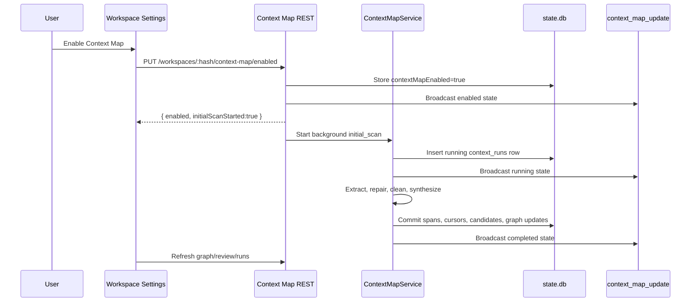

Once enabled, the feature has four normal operating loops:

- **Initial setup**: enabling a workspace starts an asynchronous `initial_scan` without requiring the user to press a separate scan button.
- **Background maintenance**: the scheduler wakes every 60 seconds, checks due enabled workspaces, and starts `scheduled` scans up to the global Concurrent Workspace Scans cap.
- **Manual rebuild**: Rescan Now starts `manual_rebuild`, which reprocesses the currently selected workspace source packets even when source cursors say they are unchanged.
- **Conversation finalization**: session reset and archive paths run best-effort final passes over unprocessed conversation spans.

Stop, disable, and clear are intentionally separate:

- **Stop** cancels only the active run and leaves unprocessed work retryable.
- **Disable** stops active work and prevents new scans/mutations, but keeps stored graph data.
- **Clear** deletes stored graph/review/run/cursor/audit data and is rejected while a run is active.

## Conceptual Model

### Entity

An entity is a durable named thing that is likely to matter again in the workspace. Examples include a person, organization, project, workflow, document, feature, concept, decision, tool, asset, service, API surface, test suite, content platform, opportunity, or planning theme.

The processor must avoid creating entities for every noun, ordinary filename, local path, source file, root folder, incidental asset, imported package, route string, or one-time mention. Files and paths are normally evidence, not entities.

### Entity Type

The system seeds these built-in entity types:

- `person`
- `organization`
- `project`
- `workflow`
- `document`
- `feature`
- `concept`
- `decision`
- `tool`
- `asset`

The processor can suggest additional workspace-specific entity types through `new_entity_type` candidates, but redundant suggestions for built-in or aliased built-in types are dropped before persistence.

Common aliases normalize into built-in types before review. Examples: `company`, `team`, `institution`, and `org` normalize to `organization`; `repo`, `repository`, and `product` normalize to `project`; `feature_proposal` and `capability` normalize to `feature`; `subsystem`, `component`, `architecture`, `security_policy`, `policy`, and `principle` normalize to `concept`; `spec`, `specification`, `adr`, `issue`, `github_issue`, `pull_request`, and `github_pull_request` normalize to `document`; `backend` and `cli` normalize to `tool`.

### Fact

A fact is a durable statement attached to an entity. Facts are used when information is useful but does not justify a standalone entity or relationship. Weak relationship evidence can be folded into facts.

### Relationship

A relationship is a typed edge between two entities. Relationship candidates must be evidence-backed and governed. The implementation accepts durable predicates such as ownership, dependency, implementation, documentation, workflow/tool usage, specification, authorship, storage, and related durable work relationships. Comparative, vague, ad-hoc, self-referential, or weak edges are dropped or folded into facts.

Allowed governed predicates are: `blocks`, `captures`, `configures`, `contains`, `depends_on`, `documents`, `documented_by`, `driven_by`, `enables`, `governs`, `implements`, `implemented_by`, `managed_by`, `owns`, `part_of`, `produces`, `references`, `relates_to`, `replaces`, `requires`, `runs_via`, `specified_by`, `stores`, `stored_in`, `supports`, `supersedes`, and `uses`.

Relationship aliases are normalized before filtering. Examples: `supports_backend` becomes `supports`, `is specified by` becomes `specified_by`, `depends on` becomes `depends_on`, and `runs through` becomes `runs_via`.

### Evidence

Evidence is the source pointer that supports an entity, fact, candidate, or relationship. Evidence can point to conversation message spans, workspace instructions, Markdown source packets, or code-outline packets. Evidence refs store enough information to inspect the source without copying full source bodies into the graph.

### Candidate

A candidate is a proposed graph change emitted by the processor. Candidates are stored before they affect active graph state. Safe high-confidence candidates can be auto-applied. Riskier candidates remain in Needs Attention until a user applies, edits, dismisses, or reopens them.

Implemented candidate types:

- `new_entity_type`
- `new_entity`
- `entity_update`
- `entity_merge`
- `alias_addition`
- `sensitivity_classification`
- `new_relationship`
- `relationship_update`
- `relationship_removal`
- `evidence_link`
- `conflict_flag`

### Context Pack

A context pack is a bounded runtime bundle retrieved from the active graph for a chat CLI. It can include matching entities, related entities, relationships, compact summaries, facts, and evidence pointers. It must not dump the entire graph into the chat context.

## Status Vocabulary

Context Map uses explicit lifecycle states so the product can preserve history without pretending every extracted thing is currently true.

| Object | Supported values | Meaning |
|--------|------------------|---------|
| Entity type origin | `system`, `user`, `processor` | Built-in catalog, user-created/edited catalog, or processor-suggested catalog item. |
| Entity, fact, relationship, entity type status | `active`, `pending`, `discarded`, `superseded`, `stale`, `conflict` | Active graph state plus lifecycle states used for governance and history. |
| Candidate status | `pending`, `active`, `discarded`, `superseded`, `stale`, `conflict`, `failed` | Candidate review/apply lifecycle. Only pending candidates are normally editable/applyable; discarded can be reopened; active candidates already mutated graph state. |
| Run source | `initial_scan`, `scheduled`, `session_reset`, `archive`, `manual_rebuild` | Why a processor run started. |
| Run status | `running`, `completed`, `failed`, `stopped` | Processor run lifecycle. |
| Source cursor status | `active`, `missing` | Whether a previously selected workspace source is still available/processable. |
| Sensitivity | `normal`, `work-sensitive`, `personal-sensitive`, `secret-pointer` | Read/search/redaction class for active entities. |

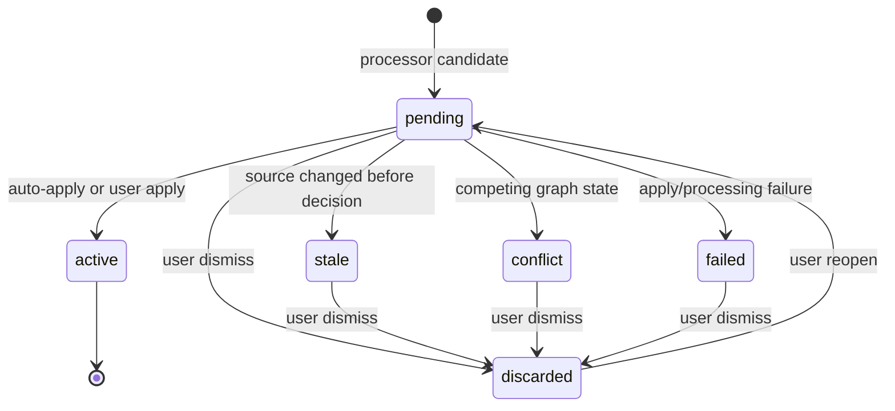

`secret-pointer` is the strictest sensitivity value. Secret-pointer entities keep identity metadata visible so the map can still refer to them, but summary, notes, facts, evidence excerpts, and audit details are withheld from entity detail and MCP responses. Search does not match hidden secret-pointer summary, notes, or facts.

## End-to-End Data Flow

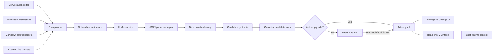

The important control points are:

- Extraction jobs are planned in deterministic source order.
- LLM output is parsed, repaired if possible, normalized, and filtered before persistence.
- Synthesis ranks, merges, drops, corrects, and folds candidates before review.
- Only safe candidates auto-apply. Everything else stays reviewable.
- Active graph reads for UI and MCP come from the same SQLite store.

## User-Facing Surfaces

### Global Settings

Global Settings includes a Context Map tab for defaults shared by all workspaces that use global processor mode.

Global settings include:

- Default Context Map CLI profile.
- Optional model and effort overrides.
- Scan interval in minutes. Default: `5`.
- Concurrent Workspace Scans. This controls how many workspace scans the scheduler can run at once. Default: `1`, clamped from `1` to `10`.
- Processor concurrency. The UI writes the same value to extraction and synthesis concurrency. Internally these remain separate settings, both defaulting to `3` and clamped from `1` to `6`.

The global settings UI does not expose source toggles. Source selection is product-owned so the scanner can stay consistent and bounded.

### Workspace Settings

Workspace Settings is a full-screen settings surface with a Context Map tab.

The Context Map tab includes:

- Internal left-rail sections for Overview, Processor, Active Map, Needs Attention, and Danger Zone.
- Enable Context Map toggle in Overview.
- Status badge and Last scan status in Overview.
- Compact metrics row for entities, relationships, and needs-attention count when enabled.
- Overview insight cards derived from the currently loaded graph/review snapshot: most connected entities, needs-review breakdown, isolated entities, and recent entity changes.
- Ephemeral initial-scan progress near enablement. It can show `Initial scan started`, `Keep rolling`, and `Initial scan completed`; it can disappear after the panel is reopened.
- Processor mode: global defaults or workspace override. Global mode shows read-only inherited processor values; Override reveals editable CLI/profile/model/effort fields.
- Optional workspace scan interval override, displayed in minutes only while Override is selected.
- Dirty processor changes reveal `Save Changes`; no persistent Context Map save button is shown when settings are unchanged.
- Active Map browse/search/filter surface with a nearby-context relationship strip derived from the filtered graph snapshot, hidden behind a compact disabled empty state when Context Map is disabled.
- Entity detail popup with a relationship-neighborhood row view that highlight the selected entity inside each one-hop relationship.
- Entity edit controls.
- Needs Attention review queue, hidden behind a compact disabled empty state when Context Map is disabled.
- Dismissed/history filter.
- Accept All for currently pending suggestions other than dismissed items.
- Candidate edit/apply/dismiss/reopen controls, with an impact preview that maps each candidate payload to the entity/type/evidence/relationship target it would change.
- Relationship dependency confirmation when a relationship needs endpoint entity candidates from the same review batch.
- Rescan Now control in Danger Zone with a tooltip explaining that manual rescan reprocesses selected workspace sources regardless of cursors.
- Stop control while any run is active.
- Clear Context Map destructive action in Danger Zone.

The Context Map left rail and right content area scroll vertically as separate panes. When Run initial scan or Rescan Now is clicked, the UI switches back to Overview and scrolls the right content pane to the top so the running progress indicator is visible.

### Chat Surface

Conversations expose compact `contextMap` status when the workspace has Context Map enabled. The composer can show a Context Map notification when items need attention or a run is active/failed. Context Map notifications are not inserted into the transcript as chat messages. Opening the notification routes to Workspace Settings on the Context Map tab; when the compact status reports pending review candidates, the Context Map tab opens directly to its Needs Attention section.

### User Workflow Summary

| User action | Immediate UI result | Backend result |
|-------------|---------------------|----------------|
| Enable Context Map | Toggle turns on, initial-scan strip appears, Last scan/running rows update as data arrives. | Workspace enablement is persisted and an async `initial_scan` starts. |
| Open Active Map | Entity cards, nearby-context relationship strip, relationship rows, filters, and detail buttons render from graph snapshot. | `GET /context-map/graph` reads active entities/relationships without modifying state. |
| Click Details | Modal opens with loading state, detail content and relationship-neighborhood rows. | `GET /context-map/entities/:entityId` reads aliases, facts, relationships, evidence, and audit rows with secret redaction. |
| Edit entity | Detail modal/card refreshes after save. | Entity row updates, audit row is inserted, update frame is broadcast. |
| Review Needs Attention | Pending or dismissed candidate groups show by source/run with candidate impact previews. | `GET /context-map/review` reads candidate rows, counts, and recent/referenced runs. |
| Open composer Context Map notification | Workspace Settings opens on Context Map; pending candidates focus the Needs Attention section, otherwise Overview remains the entry point. | No mutation; the client uses the conversation `contextMap` status already hydrated from `GET /conversations/:id` or update frames. |
| Accept All | One confirmation, then non-dismissed pending items apply in dependency-aware order. | Entity/update/evidence candidates are applied before relationships; relationship dependencies can be applied transactionally. |
| Rescan Now | Right content pane returns to Overview and shows running progress. | Async `manual_rebuild` starts and reprocesses selected workspace sources regardless of cursors. |
| Stop | Running row clears after refresh/update. | Active run aborts cooperatively and is marked `stopped`; interrupted work remains retryable. |
| Clear Context Map | Graph/review/detail UI clears after confirmation. | Store rows are deleted except settings/enablement/system entity types; active scans block this action. |

## Settings Resolution

Context Map has global processor defaults and per-workspace enablement/overrides.

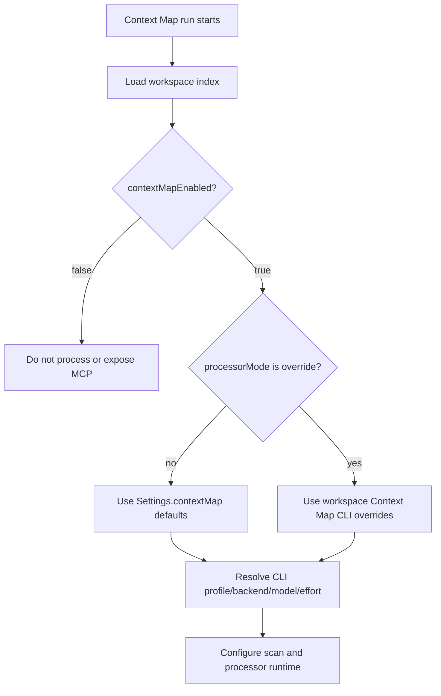

Global settings are stored under `Settings.contextMap`:

| Field | Default | Normalization | Purpose |
|-------|---------|---------------|---------|
| `cliProfileId` | unset | Must reference an enabled CLI profile to be kept. | Preferred processor CLI profile. |
| `cliBackend` | unset | Deprecated mirror/fallback. Synced from selected profile vendor when possible. | Legacy backend selector. |
| `cliModel` | unset | Kept as optional string. | Optional processor model override. |
| `cliEffort` | unset | Kept as optional supported effort value. | Optional processor effort override. |
| `scanIntervalMinutes` | `5` | Rounded and clamped to `1..1440`. | Background scheduled scan interval. |
| `cliConcurrency` | `1` | Rounded and clamped to `1..10`. | Max workspace scans the scheduler starts at once. UI label: Concurrent Workspace Scans. |
| `extractionConcurrency` | `3` | Rounded and clamped to `1..6`. | Process-wide extraction and extraction-repair `runOneShot()` cap. |
| `synthesisConcurrency` | `3` | Rounded and clamped to `1..6`. | Process-wide synthesis, final arbiter, and synthesis-repair `runOneShot()` cap. |

Workspace settings are stored under `WorkspaceIndex.contextMap`:

| Field | Default | Normalization | Purpose |
|-------|---------|---------------|---------|
| `processorMode` | `global` | Only `global` or `override`; absent behaves as `global`. | Chooses global defaults or workspace-specific processor settings. |
| `cliProfileId` | unset | Kept only in override mode when valid. | Workspace-specific processor CLI profile. |
| `cliBackend` | unset | Deprecated mirror/fallback. | Legacy workspace backend selector. |
| `cliModel` | unset | Dropped in global mode, kept in override mode. | Workspace-specific model override. |
| `cliEffort` | unset | Dropped in global mode, kept in override mode. | Workspace-specific effort override. |
| `scanIntervalMinutes` | global default | Rounded and clamped to `1..1440`. Kept in global mode too. | Workspace-specific scheduled scan interval override. |

Legacy `sources` fields are stripped/ignored everywhere. Users cannot toggle source classes in settings; source selection is product-owned and deterministic.

The global UI presents `extractionConcurrency` and `synthesisConcurrency` as one **Processor concurrency** control because most users should not need to tune them separately. Saving that UI control writes the same value to both fields. Internally they remain separate queues so extraction and synthesis can be tuned independently later without changing the data model.

## Storage Model

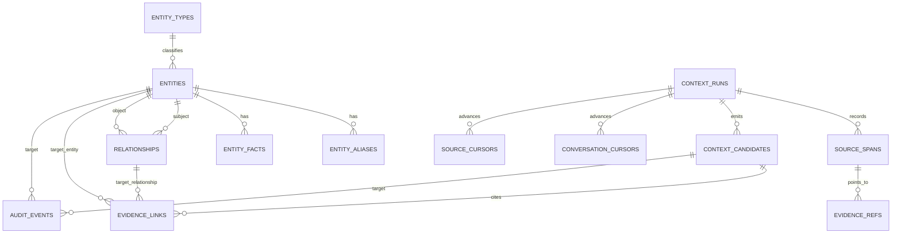

The database is opened through `src/services/contextMap/db.ts`, uses `better-sqlite3`, enables WAL mode and foreign keys, and seeds the built-in type catalog. The schema stores:

| Table | Responsibility |
|-------|----------------|
| `meta` | Schema metadata, including Context Map DB schema version. |
| `entity_types` | Built-in, user-created, and processor-suggested type catalog. |
| `entities` | Durable named things with readable fields, status, sensitivity, confidence, and timestamps. |
| `entity_aliases` | Alternate names for entity matching and display. |
| `entity_facts` | Durable fact statements attached to entities. |
| `relationships` | Typed edges between subject and object entities with status, confidence, and optional qualifiers. |
| `evidence_refs` | Source pointers with `source_type`, `source_id`, optional locator JSON, and optional excerpt. |
| `evidence_links` | Join table from evidence refs to entity/fact/relationship/candidate targets. |
| `context_runs` | Processor run source/status/timestamps/error/metadata. |
| `source_spans` | Processed conversation spans tied to a run. |
| `conversation_cursors` | Last successful conversation message range processed per conversation. |
| `source_cursors` | Last successful workspace source hash, last seen time, run id, status, and error per selected source. |
| `context_candidates` | Governed proposed graph mutations before/after review or auto-apply. |
| `audit_events` | User and processor decisions attached to entities/candidates/other targets. |

Workspace enablement and workspace-level Context Map settings are stored on `WorkspaceIndex.contextMapEnabled` and `WorkspaceIndex.contextMap`.

Supported evidence source types are intentionally broader than the sources scanned today so future targeted integrations can link reviewed evidence without schema churn: `conversation_message`, `conversation_summary`, `memory_entry`, `kb_entry`, `kb_topic`, `file`, `workspace_instruction`, `git_commit`, `github_issue`, `github_pull_request`, and `external_connector`. The current scanner attaches source-span provenance to conversation, file, workspace-instruction, and code-outline candidates; evidence refs are created only for source types in the evidence catalog. Memory/KB/GitHub/external evidence linkage is future targeted work and is not broad automatic scanning.

## Run Types

| Run source | Trigger | Conversation behavior | Workspace source behavior |
|------------|---------|-----------------------|---------------------------|
| `initial_scan` | First enablement path or initial background setup | Processes unprocessed conversation spans | Processes every selected workspace source packet |
| `manual_rebuild` | User clicks Rescan Now | Processes unprocessed conversation spans | Reprocesses every selected workspace source packet, regardless of source cursors |
| `scheduled` | Background scheduler interval | Processes only new or changed conversation spans | Processes only new, changed, or previously missing selected workspace source packets |
| `session_reset` | Session reset/archive path | Forces a final pass over unprocessed conversation range | Does not exist to rebuild workspace files |
| `archive` | Conversation archival path | Forces a final pass over unprocessed conversation range | Does not exist to rebuild workspace files |

The scheduler wakes every 60 seconds, checks Context Map enabled workspaces, applies the global or workspace scan interval, and starts due scheduled scans up to the Concurrent Workspace Scans cap.

## Source Selection

Context Map uses source packets rather than one monolithic workspace prompt. A source packet is one independently processable unit. A source can be a conversation span, workspace instruction block, one Markdown file packet, or one code-outline packet. It is not always a single physical file.

### Conversation Spans

Conversation processing is cursor-based. The service compares current conversation messages against `conversation_cursors` and extracts only the unprocessed or changed span. A cursor records enough state to detect when the last processed message range has changed and should be replaced.

### Workspace Instructions

Workspace instructions are scanned as a high-signal source packet when present.

### Markdown Files

Initial and manual scans process selected Markdown files under the workspace root. Scheduled scans discover the same set but only process changed, new, or previously missing selected packets.

High-signal Markdown paths are loaded first when present:

- `AGENTS.md`
- `CLAUDE.md`
- `README.md`
- `SPEC.md`
- `OUTLINE.md`
- `STYLE_GUIDE.md`
- `TASKS.md`
- `TODO.md`
- `docs/SPEC.md`

Markdown discovery:

- Loads known high-signal Markdown files first.
- Recursively discovers up to 120 scored `.md` files.
- Skips hard infrastructure/generated-state directories such as `.git`, `node_modules`, and `data/chat`.
- Ignores files over 1 MB.
- Sorts by deterministic path score and path order.
- Truncates each source body to 12,000 characters before prompting.
- Skips thin compatibility shims, such as short `CLAUDE.md` files that defer to `AGENTS.md`, and root `SPEC.md` redirect/index files when `docs/SPEC.md` exists.

Selected Markdown files that become empty, unreadable, oversized, or shim-skipped are treated as unprocessable and can mark an existing source cursor `missing`. Lower-ranked recursive Markdown files outside the 120-file cap remain discovered/deferred and do not cause existing cursors to be marked missing only because of the cap.

### Code Outlines

Software workspace scanning includes bounded code-outline packets. Code outlines are summaries of selected implementation/configuration files; the scanner does not send full raw code dumps.

Code-outline selection:

- Skips infrastructure/generated directories such as `.git`, `node_modules`, `data`, `dist`, `build`, `coverage`, `.next`, `.turbo`, virtualenv/cache/vendor/target/tmp-style folders.
- Ignores lock files, minified/generated declaration/map files, and files over 300 KB.
- Scores manifests, configuration, root/server/app/index entrypoints, routes/API files, services/libs, frontend/mobile files, DB/store/repository files, schedulers/managers, and settings/workspace screens.
- Considers source extensions `.c`, `.cc`, `.cpp`, `.cs`, `.go`, `.h`, `.hpp`, `.java`, `.js`, `.jsx`, `.kt`, `.mjs`, `.php`, `.py`, `.rb`, `.rs`, `.swift`, `.ts`, and `.tsx`.
- Considers manifest/config filenames such as `package.json`, `tsconfig.json`, `vite.config.ts`, `vite.config.js`, `ecosystem.config.js`, `dockerfile`, `docker-compose.yml`, `go.mod`, `cargo.toml`, `pyproject.toml`, `requirements.txt`, `pom.xml`, `settings.gradle`, and `next.config.js`.
- Keeps the top 36 files.
- Groups selected outlines into packets of six files.

Code-outline prompts extract stable implementation areas such as services, API surfaces, data stores, schedulers, backend adapters, frontend screens, mobile clients, MCP servers, build/runtime tooling, and durable test harnesses. They must avoid entities for ordinary functions, classes, imports, files, directories, route strings, package names, and dependencies.

### Source Identity

Every processed source unit gets source provenance:

| Source kind | Identity fields | Cursor behavior |
|-------------|-----------------|-----------------|
| Conversation span | `conversationId`, `sessionEpoch`, `startMessageId`, `endMessageId`, `sourceHash` | `conversation_cursors` stores the last processed message id, source hash, and timestamp. Changed last-processed spans are replaced rather than duplicated. |
| Workspace instruction | `sourceType:'workspace_instruction'`, `sourceId:'workspace-instructions'`, `sourceHash` | `source_cursors` skips unchanged scheduled runs, retries failed/missing sources, and marks missing when no longer discoverable. |
| Markdown file | `sourceType:'file'`, workspace-relative path, `sourceHash`, locator metadata | Same `source_cursors` behavior as workspace instructions. Manual rebuild ignores unchanged-source skipping. |
| Code outline packet | `sourceType:'code_outline'`, deterministic packet id, file list, `sourceHash` | Same `source_cursors` behavior. Packets are rebuilt deterministically from selected source files. |

Candidate ids are deterministic. For source packets, the volatile `sourceSpan.runId` is stripped from the candidate identity payload before hashing, so a repeated manual rebuild over unchanged source content does not recreate identical pending candidates. Semantic de-duplication also removes equivalent same-run candidates emitted from different source packets.

## Incremental Processing

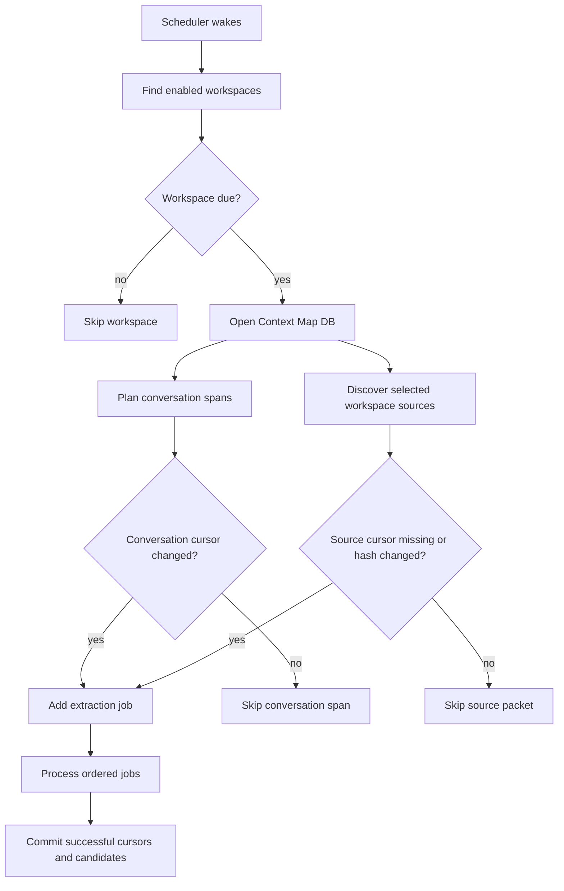

Source hashes are stable content fingerprints for processed source units. For workspace sources, `source_cursors.last_processed_source_hash` represents the last source content hash that was successfully extracted. Scheduled scans use it to avoid reprocessing unchanged selected sources. Manual rebuild scans ignore that skip decision and process every currently selected source packet again.

If a run is stopped, interrupted units do not advance conversation cursors, source cursors, source spans, or candidates. The next scheduled or manual scan can retry that work.

## Processor Algorithm

### Run Planning

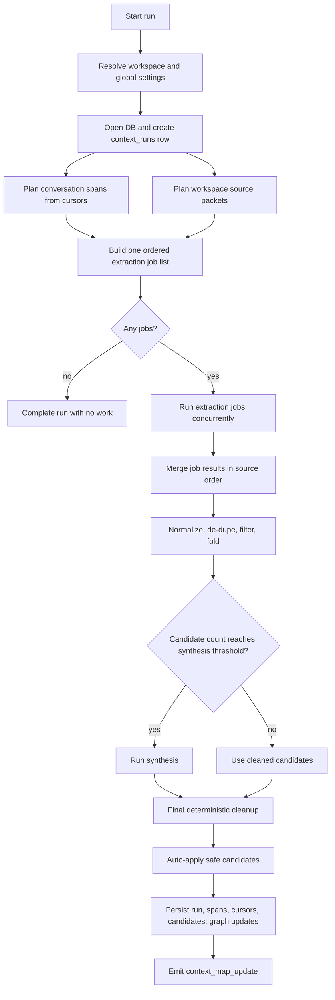

Extraction jobs for conversation spans and source packets are independent. The service builds one ordered list and runs jobs concurrently while respecting the process-wide extraction limiter. Workers return structured results rather than mutating shared arrays. Results are merged in original job order so candidate ids, evidence provenance, de-duplication, failure metadata, repairs, and timing metadata remain deterministic.

### Extraction

Each extraction job calls the configured backend adapter's `runOneShot()` with:

- `allowTools:false`
- a strict JSON prompt
- the conversation or workspace working directory
- the resolved Context Map CLI profile/model/effort
- the active run's abort signal
- a timeout of 120 seconds for extraction

The extraction prompt asks for `{ "candidates": [...] }` and includes only the source unit being processed. It tells the processor to treat filenames, paths, local assets, source files, and root folders as evidence rather than entities.

Malformed extraction JSON is handled in this order:

1. Apply deterministic local repair for common missing-comma array output.
2. Parse again.
3. If still invalid, send one repair prompt through the same Context Map processor using the extraction JSON shape and no tools.
4. If repair fails, mark that extraction unit failed and leave it retryable.

The local extraction/synthesis JSON extraction, deterministic repair, and bounded JSON repair prompt runner helpers live in `src/services/contextMap/jsonRepair.ts`. The service imports that module instead of carrying parser repair logic inline, so the deterministic repair path and the retry prompt boundary are unit-testable separately from processor orchestration. The service still supplies the extraction or synthesis limiter callback so repair calls remain counted under the correct process-wide concurrency cap.

Extraction failures are isolated per unit. If one source packet fails but others succeed, successful units still commit. Failed source packets do not advance `source_cursors`.

### Deterministic Cleanup

Before synthesis or persistence, the service applies deterministic guards. These guards are the first quality layer and exist to keep the review queue clean even when the processor over-extracts.

Cleanup includes:

- Normalizing built-in type aliases such as `product`, `feature_proposal`, `capability`, `subsystem`, `backend`, `issue`, `pull_request`, `architecture`, `security_policy`, and `principle`.
- Dropping redundant `new_entity_type` candidates for built-in types.
- Preserving custom entity type slugs only when the same processor output includes a matching `new_entity_type` candidate.
- Normalizing aliases and fact payloads into readable strings.
- Merging alternate fact fields into canonical `payload.facts`.
- Correcting obvious source-path sensitivity mismatches while keeping `secret-pointer` sticky.
- Normalizing legacy relationship keys and common predicates.
- Dropping self-relationships.
- Dropping non-governed comparative or ad-hoc relationship predicates.
- Rejecting weak `implements` / `implemented_by` feature-to-feature placement edges.
- Rejecting low-confidence `part_of` root/project edges.
- Folding weak relationship evidence into entity facts when useful.
- Folding same-output sensitivity classifications onto matching new entities.
- Dropping orphan sensitivity classifications.
- De-duplicating equivalent candidates within the same run.
- Converting new-entity proposals that match active entities into `entity_update` candidates.
- Dropping no-op source rescan updates.
- Dropping update candidates without active targets.
- Resolving relationship endpoints against active entities, existing pending entities, or same-run entity suggestions.

### Source Budgets

The scanner enforces source-local candidate caps before synthesis:

| Source shape | Candidate budget |
|--------------|------------------|
| Workspace instructions | 4 |
| `AGENTS.md` / `CLAUDE.md` | 3 |
| `README.md`, `SPEC.md`, `docs/SPEC.md` | 5 |
| `workflows/*`, `context/contact-*` | 4 |
| `drafts/*` | 3 |
| Blog/theme content under `repos/*` | 2 |
| Other Markdown source packets | 5 |
| Code-outline packets | 8 |

For source shapes that commonly contain durable edges, the cap reserves one slot for a strict evidence-backed relationship when one was emitted. Code-outline packets reserve up to two relationship slots.

### Synthesis

Synthesis is the second quality layer. It reduces noisy but valid candidate sets into a smaller, more useful set.

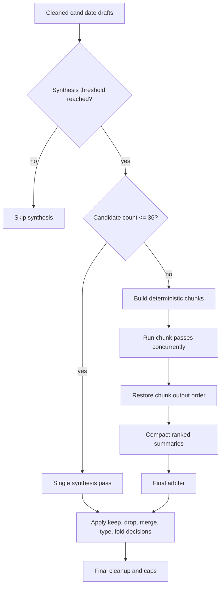

Synthesis runs when cleaned candidate drafts reach at least eight candidates, or at least three candidates for scheduled runs. This lower scheduled threshold helps background maintenance clean up smaller incremental batches before they reach the review queue.

Up to 36 candidates use one synthesis pass. Larger sets are bucketed into deterministic chunks of up to 36 candidates. Chunk synthesis passes run concurrently while respecting the process-wide synthesis limiter. Results, stage metadata, and concatenated drafts are restored to original chunk order before the final arbiter runs.

The final arbiter sees compact summaries, not unbounded full candidate payloads. It returns decisions such as:

- `keepRefs`
- `dropRefs`
- `mergeGroups`
- `typeCorrections`
- `relationshipToFactRefs`

The final synthesis target is 34 or fewer candidates with a hard cap of 45. The service can recover up to 12 strict relationship candidates from original extraction when both endpoints survived synthesis.

Malformed synthesis output is handled with deterministic local repair first, then one bounded JSON repair prompt from `jsonRepair.ts`. Invalid chunk synthesis falls back to ranked bounded subsets for that chunk. Invalid final arbiter output falls back to a ranked reduced set capped at 40 candidates before final cleanup. Synthesis failure must not flood Needs Attention.

### Concurrency

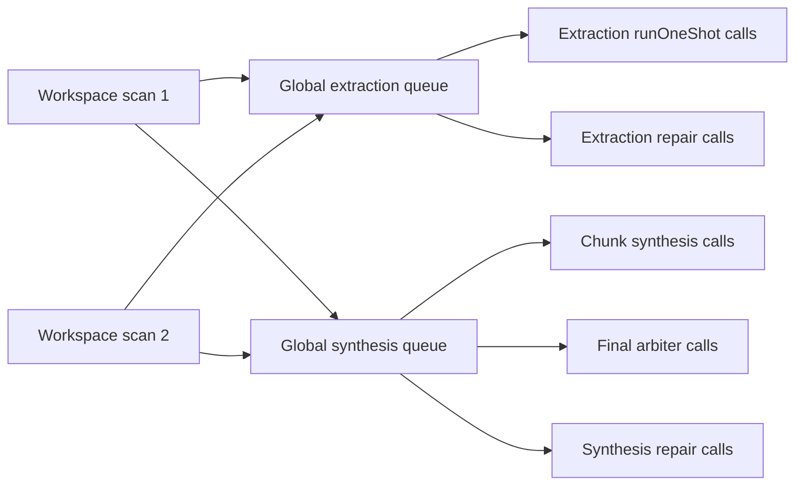

Concurrency settings are process-wide in the running server process:

- Concurrent Workspace Scans controls how many workspace scans the scheduler can start at once.
- Extraction concurrency caps extraction `runOneShot()` calls and extraction JSON repair calls across all active Context Map scans.
- Synthesis concurrency caps chunk synthesis, final arbiter, and synthesis/arbiter JSON repair calls across all active Context Map scans.

Queued work checks the active run's abort signal before starting. Active backend calls receive the same abort signal. Stop/abort prevents queued work from starting and asks active work to stop when the adapter supports it.

## Candidate Decisions

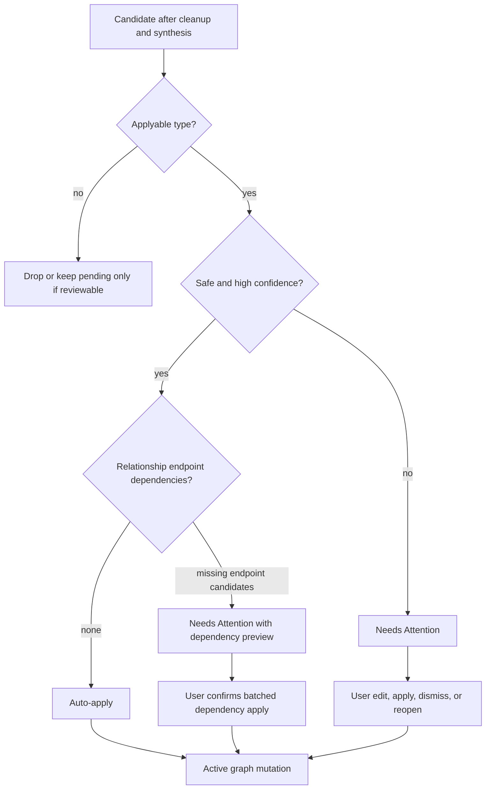

Auto-apply is deliberately conservative. The implemented policy auto-applies only still-pending candidates with source-span provenance and type-specific safety checks:

| Candidate type | Minimum confidence | Additional constraints |
|----------------|--------------------|------------------------|
| `new_entity` | `0.80` | Known built-in/existing entity type, readable summary/notes/facts, safe sensitivity (`normal`, `work-sensitive`, or `personal-sensitive`), never `secret-pointer`. |
| `new_relationship` | `0.80` | Durable non-generic predicate, evidence present, endpoints already resolve, no pending endpoint dependency, not a self-relationship. |
| `entity_update` | `0.90` | Additive only: add facts/aliases/evidence or fill an empty summary/notes field. No rename, type/status/sensitivity change, or overwrite of existing summary/notes. |
| `alias_addition` | `0.94` | Alias can be applied without creating a filename/path alias or conflicting with existing identity. |
| `sensitivity_classification` | `0.96` | More restrictive only. Downgrades, no-ops, and work-vs-personal lateral changes stay pending. |
| `evidence_link` | `0.96` | Concrete evidence target is resolved and safe to attach. |

Completed runs re-evaluate both newly inserted candidates and existing pending candidates, so candidates left pending under an older policy can become active once they satisfy the current safe auto-apply rules.

Candidates remain pending when they are risky, ambiguous, destructive, conflicting, below policy confidence, dependent on pending endpoint entities, or otherwise require user judgment. Sensitivity downgrades do not auto-apply.

Relationship candidates require existing subject/object entities or a single unambiguous pending `new_entity` candidate for a missing endpoint. When pending endpoint candidates are required, the API returns dependency metadata. The UI confirmation explains that applying the relationship will also apply the needed endpoint entity candidates in one transaction.

Candidate apply semantics:

| Candidate type | Apply result |
|----------------|--------------|
| `new_entity_type` | Creates or reuses an entity type with processor/user origin and active status. |
| `new_entity` | Creates or reuses an active entity by case-insensitive `(typeSlug, name)`, persists aliases/facts, and links source-span evidence when valid. |
| `entity_update` | Updates readable fields and can add aliases/facts/evidence. Auto-apply only allows additive updates; manual apply can perform the validated update. |
| `entity_merge` | Marks source entities `superseded`, carries their names/aliases onto the target, and preserves history. |
| `alias_addition` | Adds an alias to an existing entity. |
| `sensitivity_classification` | Updates entity sensitivity when the target resolves and the requested sensitivity is valid. |
| `new_relationship` | Creates or reuses an active relationship after resolving subject/object endpoints. May require dependency confirmation. |
| `relationship_update` | Updates predicate/endpoints/status/confidence/qualifiers for an existing relationship. |
| `relationship_removal` | Marks a relationship `superseded` by default instead of physically deleting it. |
| `evidence_link` | Links explicit evidence or source-span evidence to an entity, fact, relationship, or candidate target. |
| `conflict_flag` | Marks an entity or relationship as `conflict`. |

## Active Map and Review Behavior

Active Map reads show active graph state and support query, type, status, sensitivity, and limit filters. Default entity status is `active`; `status=all` includes lifecycle states. The Workspace Settings UI derives a nearby-context strip from the returned relationship rows so filtered/search results show a small set of connected paths without rendering the entire graph.

Entity detail opens as a popup. It includes aliases, facts, relationships, evidence refs, and entity-target audit events. Relationship rows render as a one-hop neighborhood and highlight the selected entity on the subject or object side. Users can edit name, type, status, sensitivity, summary, notes, and confidence.

Needs Attention reads `context_candidates` with status filtering. The default status is `pending`. Dismissed items remain queryable in dismissed/history views and can be reopened. Dismissed candidates are not affected by Accept All. Candidate cards derive a compact impact preview from the payload so reviewers can see the proposed node/edge/evidence target before opening the editable JSON payload.

Candidate application writes graph changes, links evidence, marks the candidate active, emits audit events, and sends `context_map_update` to connected clients. Candidate dismissal and reopen also emit audit events.

## Stop, Disable, Clear, and Retry Semantics

Stop:

- Aborts the active run's `AbortController`.
- Marks the run `stopped`.
- Emits a Context Map update.
- Does not disable Context Map.
- Does not clear existing graph/review data.
- Leaves interrupted work retryable.

Disable:

- Stops an active run before disabling.
- Prevents new scans and mutation routes.
- Leaves stored Context Map data in place.

Clear:

- Removes graph, candidates, evidence, runs, cursors, and audit rows.
- Preserves workspace enablement/settings.
- Preserves seeded system entity types.
- Returns `409` while a scan is active.

Failures:

- A unit failure leaves that unit retryable.
- A partially successful run can complete with warning metadata.
- A run where every attempted extraction unit fails is marked `failed`.
- Synthesis failures fall back to bounded candidate sets instead of flooding review.

## Run Metadata and Diagnostics

Each `context_runs.metadata` object is diagnostic state for understanding scan quality and performance. It is not required to render the active map, but it is required for debugging and for the report script.

Important metadata groups:

| Metadata group | Examples | Purpose |
|----------------|----------|---------|
| Source discovery | `sourcePacketsDiscovered`, `sourcePacketsProcessed`, `sourcePacketsSkippedUnchanged`, `sourcePacketsSucceeded`, `sourceCursorsMarkedMissing`, `staleSources` | Explains what the scanner found, skipped, processed, and marked missing. |
| Extraction quality | `extractionUnitsFailed`, `extractionFailures`, `extractionRepairs` | Shows malformed JSON/backend failures and whether repair succeeded. |
| Candidate synthesis | `candidateSynthesis` with input/output counts, candidate type counts, dropped counts, open questions, stage metadata, fallback state, repair state, recovered relationship count, fallback bound | Explains how raw extraction was reduced and whether synthesis fell back. |
| Candidate outcomes | `candidatesInserted`, `candidatesAutoApplied`, `existingCandidatesAutoApplied`, `candidatesNeedingAttention`, `autoApplyFailures` | Explains how much work reached the active graph versus Needs Attention. |
| Timings | total/planning/source-discovery/extraction/synthesis/persistence/auto-apply durations, extraction unit timings, slowest units, synthesis stage durations | Helps tune performance without changing source selection or prompt quality. |

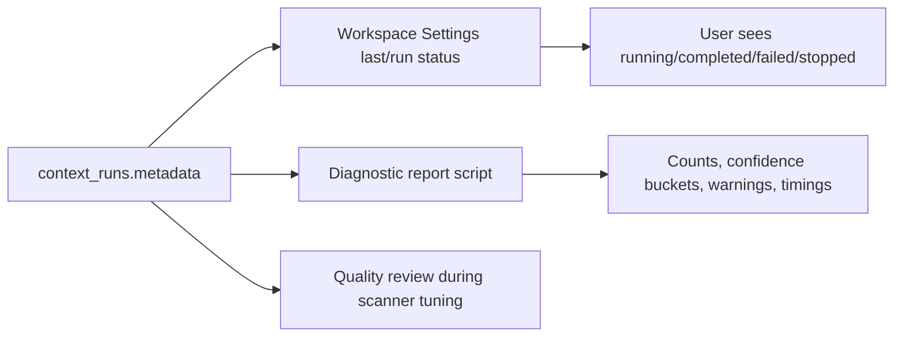

The diagnostic script is available through:

```bash
npm run context-map:report -- --workspace <hash-or-workspace-path>
npm run context-map:report -- --db <path-to-state.db>
npm run context-map:report -- --workspace <hash-or-workspace-path> --json
```

It opens the Context Map SQLite database read-only and reports latest run status, extraction/synthesis counts, auto-applied versus Needs Attention totals, entity/relationship/candidate distributions, confidence buckets, estimated auto-apply eligibility, source cursor status counts, malformed fact warnings, non-canonical fact-field warnings, self-relationship warnings, and timing data.

## Runtime Retrieval Through MCP

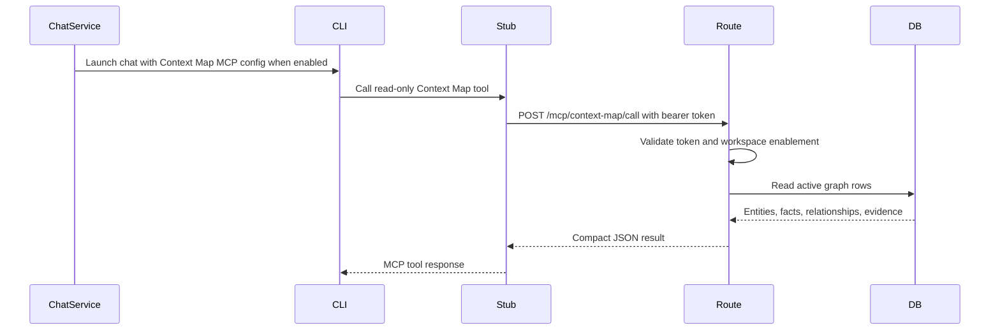

The Context Map MCP server uses the same stdio-stub pattern as other local MCP helpers. `issueContextMapMcpSession()` creates a bearer-token session scoped to the conversation/workspace. `createContextMapMcpServer()` exposes only read-only tools:

| Tool | Arguments | Limits and behavior |
|------|-----------|---------------------|
| `entity_search` | `query`, optional `types`, optional `limit` | Searches active entities by name/alias and, for non-secret entities only, summary/notes/active facts. Default limit `10`, max `50`. |
| `get_entity` | `id` or `entity_id`, optional `includeEvidence` / `include_evidence` | Returns one active entity with aliases, facts, relationships, and optional evidence. Secret-pointer readable fields/evidence are withheld. |
| `get_related_entities` | `id` or `entity_id`, optional `depth`, optional `relationshipTypes` / `relationship_types`, optional `limit` | Traverses active relationships from one active entity. Depth is clamped to `1..2`; limit defaults to `10` and maxes at `50`. |
| `context_pack` | `query`, optional `maxEntities` / `max_entities`, optional `includeFiles`, optional `includeConversations` | Runs entity search, expands detail, and filters evidence refs. Default entity count `5`, max `10`; file and conversation evidence are included by default. |

The MCP route verifies the token and that Context Map is still enabled for the workspace before reading the graph.

## Privacy and Secret Handling

Context Map may store sensitive personal or work information. The implementation includes these safeguards:

- MCP access is read-only.
- Processor calls use `allowTools:false`.
- The active chat CLI cannot directly write entities, facts, relationships, or candidates.
- `secret-pointer` entities withhold summary, notes, facts, and evidence content from MCP results and entity detail responses.
- Search over `secret-pointer` entities is limited to identity fields such as name/aliases and does not search hidden summary, notes, or facts.
- Audit-event details for `secret-pointer` entity detail views are redacted.
- Context Map does not broadly scan Memory or KB stores.

## REST and WebSocket Surface

Context Map routes are workspace-scoped unless noted. Mutating routes require CSRF except for the bearer-token MCP endpoint.

| Method | Path | CSRF | Main behavior |
|--------|------|------|---------------|
| `GET` | `/workspaces/:hash/context-map/settings` | No | Returns `{ enabled, settings }`; absent workspace settings normalize to `{ processorMode:'global' }`. |
| `PUT` | `/workspaces/:hash/context-map/settings` | Yes | Saves workspace Context Map settings. Accepts `{ settings }` or direct settings object. Ignores legacy `sources`. |
| `PUT` | `/workspaces/:hash/context-map/enabled` | Yes | Toggles workspace enablement. Enabling starts async initial scan when transitioning from disabled; disabling stops active scan first. |
| `POST` | `/workspaces/:hash/context-map/scan` | Yes | Starts async `manual_rebuild`; returns immediately with `{ ok:true, started:true, source:'manual_rebuild' }`. Rejects disabled workspaces and already-running scans. |
| `POST` | `/workspaces/:hash/context-map/scan/stop` | Yes | Stops the active run if any. Does not require the workspace to still be enabled. |
| `DELETE` | `/workspaces/:hash/context-map` | Yes | Clears graph/candidate/evidence/run/cursor/audit state while preserving enablement/settings/system types. Rejects active scans. |
| `GET` | `/workspaces/:hash/context-map/graph` | No | Returns Active Map snapshot with query/type/status/sensitivity/limit filters. Disabled workspaces return an empty snapshot without opening storage. |
| `GET` | `/workspaces/:hash/context-map/entities/:entityId` | No | Returns entity detail with aliases, facts, relationships, evidence, and audit events. Disabled workspace returns `403`. Secret-pointer readable fields are withheld. |
| `PUT` | `/workspaces/:hash/context-map/entities/:entityId` | Yes | Edits entity name, type, status, sensitivity, summary, notes, and confidence. Writes audit and broadcasts update. |
| `GET` | `/workspaces/:hash/context-map/review` | No | Returns candidates filtered by `status` plus counts and referenced/recent runs. Default status is `pending`; disabled workspaces return empty queue. |
| `PUT` | `/workspaces/:hash/context-map/candidates/:candidateId` | Yes | Edits pending candidate payload/confidence. Preserves existing `payload.sourceSpan` when omitted. Writes audit. |
| `POST` | `/workspaces/:hash/context-map/candidates/:candidateId/apply` | Yes | Applies pending candidate. Optional `{ includeDependencies:true }` applies exact endpoint entity dependencies for relationship candidates in one transaction. |
| `POST` | `/workspaces/:hash/context-map/candidates/:candidateId/discard` | Yes | Marks pending/stale/conflict/failed candidate discarded. Does not mutate active graph. |
| `POST` | `/workspaces/:hash/context-map/candidates/:candidateId/reopen` | Yes | Restores discarded candidate to pending. Idempotent for already-pending candidates. |
| `POST` | `/mcp/context-map/call` | Bearer token, no CSRF | Internal read-only MCP endpoint. Validates `X-Context-Map-Token`, workspace enablement, tool name, and then reads active graph. |

Common response semantics:

- Unknown workspace returns `404`.
- Invalid filters, invalid payload shapes, invalid booleans, invalid entity status/sensitivity, and invalid candidate payload/confidence return `400`.
- Disabled workspaces return `403` for mutation/detail/scan/MCP routes that require an active map, while graph/review reads return empty disabled snapshots.
- Active scan conflicts return `409` for manual scan and clear.
- Applying relationship candidates with unresolved exact pending endpoint dependencies returns `409` with `dependencies`.
- Applying, editing, dismissing, or reopening candidates outside allowed lifecycle states returns `409`.

Workspace-scoped `context_map_update` frames update connected clients after processor starts/completions, candidate decisions, entity edits, clear/reset, enablement changes, and related state changes.

`GET /conversations/:id` hydrates compact conversation `contextMap` status for enabled workspaces. That status includes enablement, pending flag, candidate counts, running/failed run counts, latest run metadata, and last run metadata.

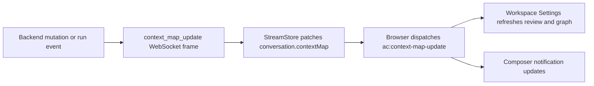

The frontend also polls while it is waiting for an initial scan or any visible running run, so completion can clear the in-progress UI even if a WebSocket frame was missed.

## Quality Rules

The scanner is expected to prefer no candidate over weak extraction. Quality rules include:

- Do not turn every physical file into an entity.
- Do not turn SVGs, local assets, root folders, generic paths, route strings, imports, packages, ordinary functions, or ordinary classes into entities.
- Treat files, paths, and source packets as evidence unless the document itself is durable workspace knowledge.
- Prefer built-in entity types unless a custom type is genuinely needed.
- Use `feature` for user-facing capabilities, behavior areas, and feature proposals.
- Use `document` for maintained specs, ADR collections, roadmaps, plans, and similar artifacts.
- Prefer facts over weak relationships.
- Create relationships only when evidence supports a durable edge.
- Keep candidate counts small enough that normal users should not need to review routine background maintenance.

## Test Coverage

The Context Map feature is covered by focused backend, route, frontend-static, settings, stream-store, and workspace tests.

| Test file | Coverage area |
|-----------|---------------|
| `test/contextMap.db.test.ts` | SQLite schema bootstrap, seeded type catalog, entity/type/fact/relationship/evidence/run/cursor/candidate/audit CRUD, candidate status updates, source cursor missing-state recovery, clear-all reset. |
| `test/contextMap.service.test.ts` | Processor planning, initial/scheduled/manual/reset/archive runs, conversation cursors, workspace source packets, recursive Markdown scanning, code outlines, source cursors, deterministic cleanup, synthesis, JSON repair, auto-apply, stop behavior, partial failures, scheduler timing, run metadata, and global extraction/synthesis concurrency. |
| `test/contextMap.pipelineMetadata.test.ts` | Pure pipeline metadata helpers for extraction timing summaries, run timing composition, empty synthesis metadata, draft type counts, repair summaries, failure messages, and bounded error truncation. |
| `test/contextMap.mcp.test.ts` | MCP token lifecycle, tool schema, disabled/missing-token failures, active graph search/detail/relationship/context-pack reads, and secret-pointer read/search redaction. |
| `test/chat.contextMap.test.ts` | REST enablement/settings/graph/entity/review/scan/stop/clear/candidate routes, disabled/unknown/error behavior, dependency apply flow, workspace update emissions, MCP injection into chat sends, and final reset/archive processing passes. |
| `test/frontendRoutes.test.ts` | Static guards for Global Settings, Workspace Settings, Context Map overview insight cards, Active Map nearby context, relationship-neighborhood details modal, Needs Attention impact previews, Accept All, source grouping, stop/rescan/clear controls, tooltips, source-toggle absence, and CSS hooks. |
| `test/settingsService.test.ts` | Global Context Map defaults, CLI profile normalization, concurrency/interval clamps, legacy backend/profile mirroring, and legacy `sources` stripping. |
| `test/streamStore.test.ts` | `context_map_update` frame handling and browser `ac:context-map-update` dispatch. |
| `test/chatService.workspace.test.ts` | Per-workspace enablement defaults/persistence, Memory/KB independence, enabled workspace listing, workspace override defaults, interval clamps, and legacy source-toggle ignoring. |

When changing Context Map behavior, update this feature spec plus the lower-level spec file that owns the exact surface area changed. For example, route payload changes belong here and in `spec-api-endpoints.md`; schema changes belong here and in `spec-data-models.md`; UI behavior changes belong here and in `spec-frontend.md`.

## Implementation Files

Core backend implementation:

- `src/services/contextMap/db.ts`
- `src/services/contextMap/service.ts`
- `src/services/contextMap/apply.ts`
- `src/services/contextMap/jsonRepair.ts`
- `src/services/contextMap/pipelineMetadata.ts`
- `src/services/contextMap/mcp.ts`
- `src/services/contextMap/defaults.ts`
- `src/services/contextMap/stub.cjs`
- `src/routes/chat.ts`
- `src/routes/chat/contextMapRoutes.ts`
- `src/services/chatService.ts`
- `src/services/settingsService.ts`

Frontend implementation:

- `web/AgentCockpitWeb/src/workspaceSettings.jsx`
- `web/AgentCockpitWeb/src/screens/settingsScreen.jsx`
- `web/AgentCockpitWeb/src/api.js`
- `web/AgentCockpitWeb/src/streamStore.js`
- `web/AgentCockpitWeb/src/shell.jsx`
- `web/AgentCockpitWeb/src/app.css`

Diagnostics:

- `scripts/context-map-report.ts`

Primary tests:

- `test/contextMap.db.test.ts`
- `test/contextMap.service.test.ts`
- `test/contextMap.jsonRepair.test.ts`
- `test/contextMap.pipelineMetadata.test.ts`
- `test/contextMap.mcp.test.ts`
- `test/chat.contextMap.test.ts`
- `test/frontendRoutes.test.ts`
- `test/settingsService.test.ts`
- `test/streamStore.test.ts`
- `test/chatService.workspace.test.ts`
