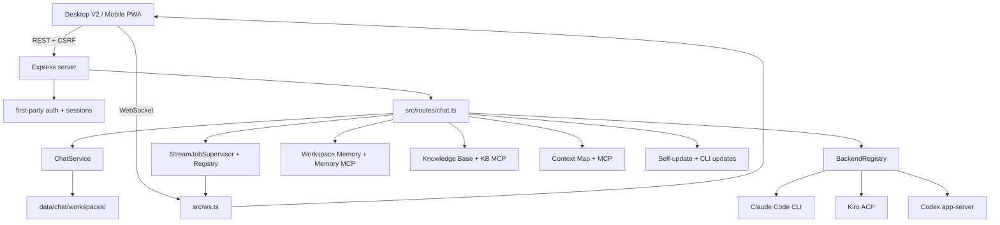
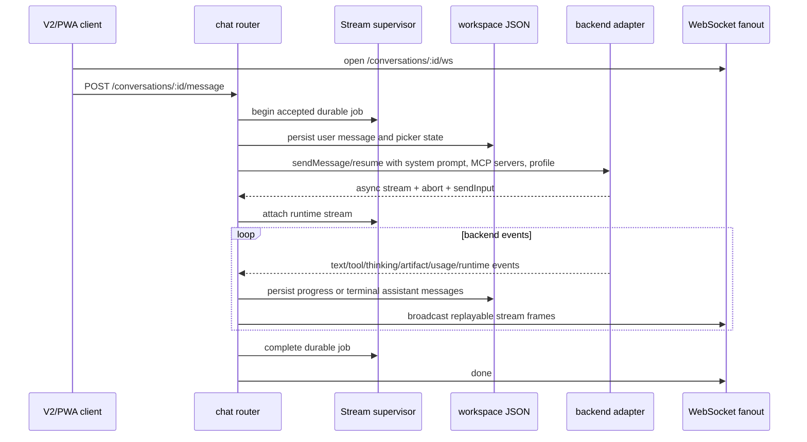
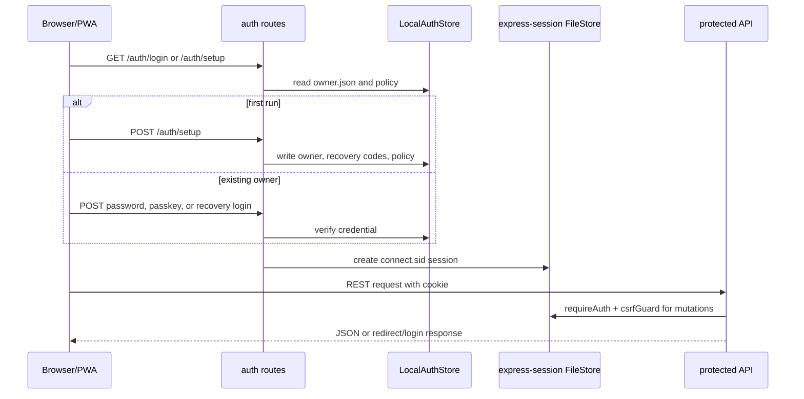
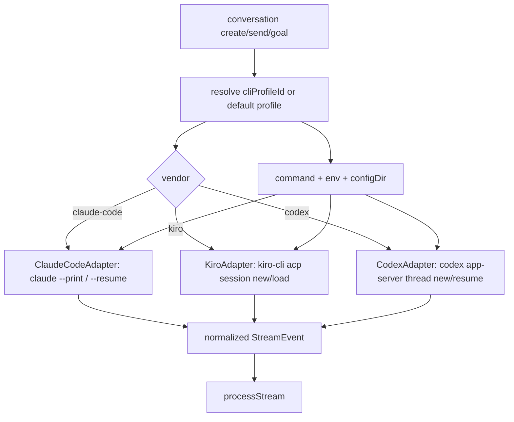
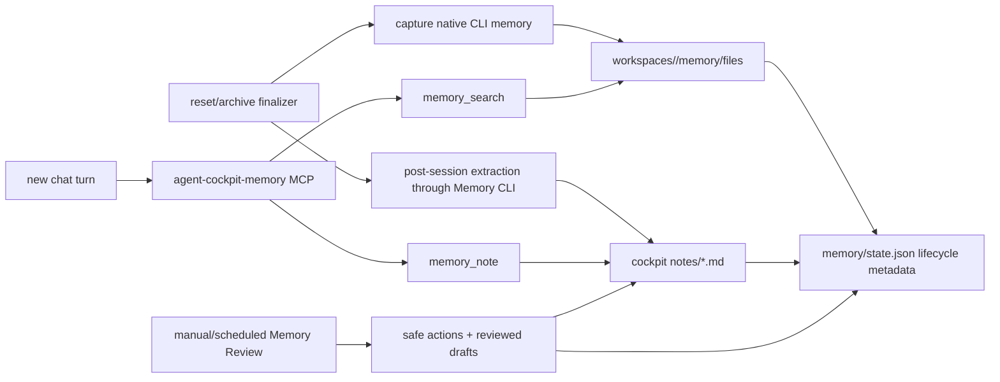
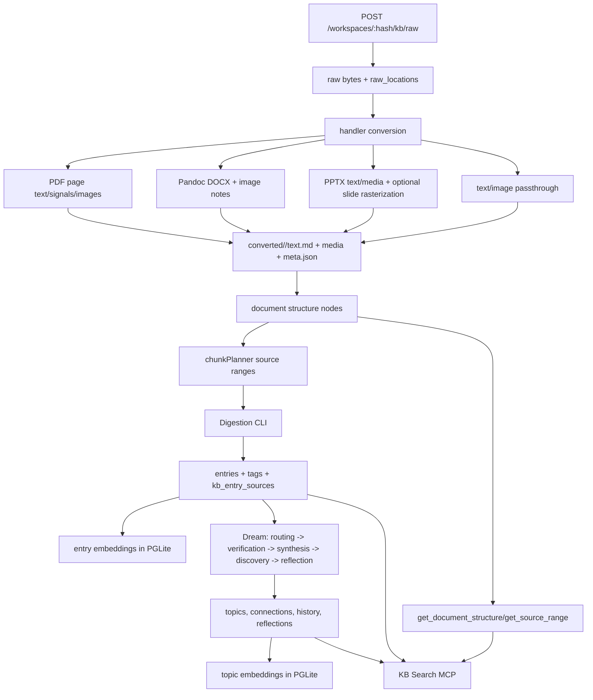
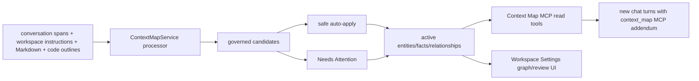
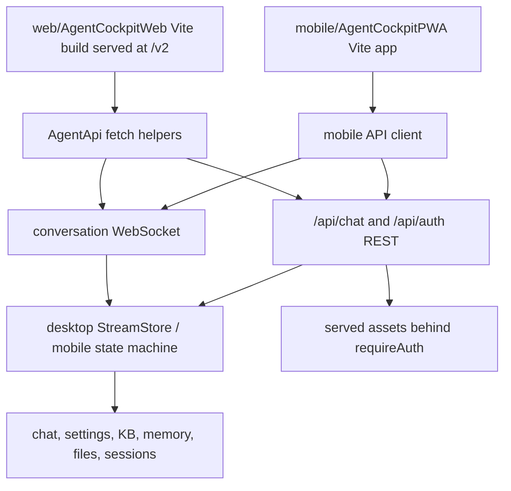
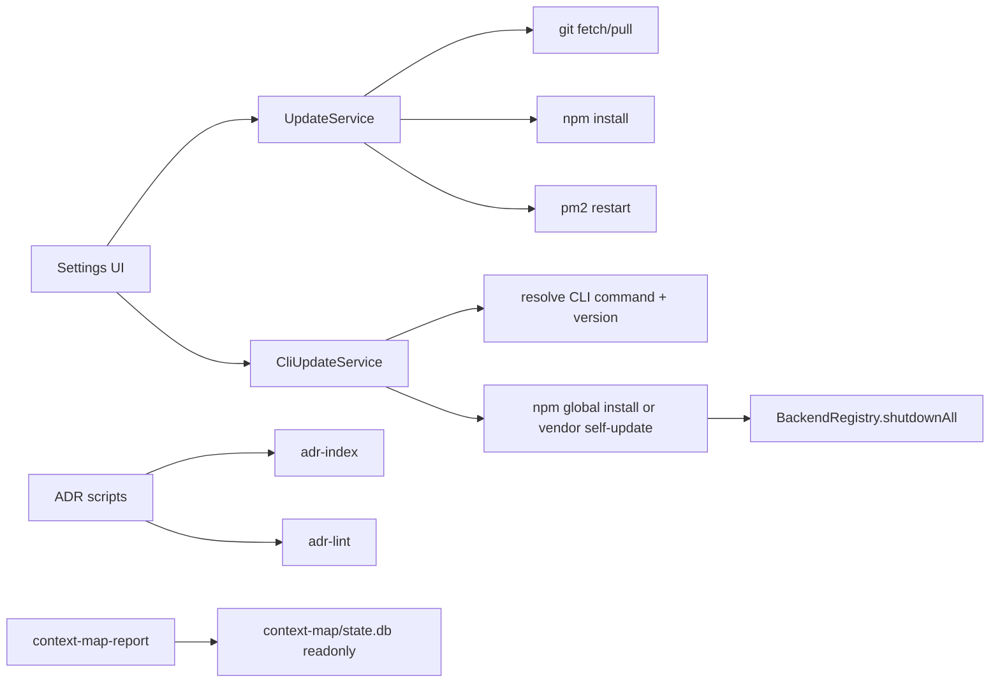

# Documentation Coverage and Feature Flows

[<- Back to index](SPEC.md)

---

This document is the coverage map for the repository documentation. The source
of truth is the current working tree. The canonical behavior remains in the
feature specs linked below; this file records how docs, source files, tests, and
diagrams line up so future changes can see what must be updated.

## Audit Method

1. Inventory tracked documentation with `git ls-files '*.md' '*.mdx' '.kiro/**'`.
2. Inventory source files under `server.ts`, `src/**`, `public/**`,
   `mobile/AgentCockpitPWA/**`, `scripts/**`, and `test/**`.
3. Compare route declarations in `server.ts`, `src/middleware/auth.ts`, and
   `src/routes/chat.ts` against `docs/spec-api-endpoints.md`.
4. Compare environment/config usage against `docs/spec-server-security.md` and
   `README.md`.
5. Compare top-level test files against `docs/spec-testing.md`.
6. Check each feature subsystem below has at least one canonical spec section,
   source path set, test evidence, and diagram coverage.

## Documentation Inventory

| Documentation group | Files | Purpose |
|---|---|---|
| Project entry and setup | `README.md`, `ONBOARDING.md`, `BACKENDS.md` | Product overview, self-hosting, backend capability comparison. |
| Agent guidance | `AGENTS.md`, `CLAUDE.md`, `.kiro/steering/claude-md.md` | Repository instructions for coding agents and cross-tool compatibility. |
| Canonical spec index | `SPEC.md`, `docs/SPEC.md` | Thin root redirect plus the canonical spec table of contents. |
| Canonical feature specs | `docs/spec-data-models.md`, `docs/spec-api-endpoints.md`, `docs/spec-backend-services.md`, `docs/spec-context-map.md`, `docs/spec-server-security.md`, `docs/spec-frontend.md`, `docs/spec-mobile-pwa.md`, `docs/spec-deployment.md`, `docs/spec-testing.md` | Current implemented behavior by area. |
| Coverage and diagrams | `docs/spec-coverage.md` | This traceability matrix and cross-feature flow diagrams. |
| Design/planning docs | `docs/design-context-map.md`, `docs/design-kb-ingestion-hybrid.md`, `docs/design-kb-vnext-implementation-plan.md`, `CLI_PROFILES_MULTI_ACCOUNT_PLAN.md` | Proposed or implemented design intent. Status headings decide whether content is current behavior or future scope. |
| Notes/findings | `docs/notes-kiro-bedrock-parity.md`, `docs/parity-decisions.md` | Durable empirical findings and intentional parity differences. |
| ADRs | `docs/adr/*.md`, `docs/adr/README.md`, `docs/adr/_template.md` | Architecture decision history. Accepted ADR content is not rewritten except status/supersession fields. |

## Source Coverage Matrix

| Feature or subsystem | Source evidence | Canonical docs | Test evidence | Diagram coverage |
|---|---|---|---|---|
| Server boot, config, sessions, security headers | `server.ts`, `src/config/index.ts`, `src/middleware/auth.ts`, `src/middleware/csrf.ts`, `src/middleware/security.ts`, `src/types/session-file-store.d.ts`, `src/utils/logger.ts` | `docs/spec-server-security.md`, `docs/spec-api-endpoints.md`, `docs/spec-deployment.md`, `README.md`, `ONBOARDING.md` | `test/auth.test.ts`, `test/graceful-shutdown.test.ts`, `test/frontendRoutes.test.ts`, `test/logger.test.ts` | Auth/session flow below; startup sequence in `docs/spec-server-security.md`. |
| Conversation, workspace, session, message, queue, archive, unread, usage ledger | `src/services/chatService.ts`, `src/services/chat/messageQueueStore.ts`, `src/types/index.ts`, `src/contracts/*.ts`, `src/routes/chat.ts`, `src/routes/chat/conversationRoutes.ts`, `src/utils/atomicWrite.ts`, `src/utils/keyedMutex.ts` | `docs/spec-data-models.md`, `docs/spec-api-endpoints.md`, `docs/spec-backend-services.md`, `docs/spec-deployment.md` | `test/chatContracts.test.ts`, `test/chatService.*.test.ts`, `test/chat.*.test.ts`, `test/messageQueue.test.ts`, `test/sessionStore.test.ts`, `test/usageProjection.test.ts`, `test/utils.*.test.ts` | Chat lifecycle below. |
| Streaming, WebSocket replay, abort, durable stream jobs, finalizers | `src/ws.ts`, `src/services/streamJobRegistry.ts`, `src/services/streamJobSupervisor.ts`, `src/services/sessionFinalizerQueue.ts`, `src/routes/chat.ts`, `src/routes/chat/streamRoutes.ts`, `src/routes/chat/goalRoutes.ts` | `docs/spec-api-endpoints.md`, `docs/spec-backend-services.md`, `docs/spec-data-models.md` | `test/chat.websocket.test.ts`, `test/chat.streaming.test.ts`, `test/chat.rest.test.ts`, `test/sessionFinalizerQueue.test.ts`, `test/streamStore.test.ts` | Chat lifecycle below. |
| Backend adapters and CLI profiles | `src/services/backends/base.ts`, `src/services/backends/registry.ts`, `src/services/backends/toolUtils.ts`, `src/services/backends/claudeCode.ts`, `src/services/backends/kiro.ts`, `src/services/backends/codex.ts`, `src/services/cliProfiles.ts`, `src/services/cliProfileAuthService.ts` | `docs/spec-backend-services.md`, `docs/spec-api-endpoints.md`, `docs/spec-data-models.md`, `BACKENDS.md`, `CLI_PROFILES_MULTI_ACCOUNT_PLAN.md` | `test/backends.test.ts`, `test/toolUtils.test.ts`, `test/kiroBackend.test.ts`, `test/codexBackend.test.ts`, `test/chat.cliProfileAuth.test.ts` | Adapter dispatch flow below. |
| Codex thread goals | `src/services/backends/codex.ts`, `src/routes/chat.ts`, `src/routes/chat/goalRoutes.ts`, `src/types/index.ts`, `web/AgentCockpitWeb/src/shell.jsx`, `web/AgentCockpitWeb/src/streamStore.js` | `docs/spec-api-endpoints.md`, `docs/spec-backend-services.md`, `docs/spec-frontend.md`, `docs/spec-mobile-pwa.md`, `BACKENDS.md`, `docs/adr/0032-use-codex-thread-goals-for-goal-mode.md` | `test/codexBackend.test.ts`, `test/chat.rest.test.ts`, `test/frontendRoutes.test.ts` | Adapter dispatch and chat lifecycle below. |
| Attachments, generated artifacts, OCR, file delivery | `src/routes/chat.ts`, `src/routes/chat/uploadRoutes.ts`, `src/services/backends/*`, `web/AgentCockpitWeb/src/fileLinks.ts`, `web/AgentCockpitWeb/src/shell.jsx`, `web/AgentCockpitWeb/src/chat/attachments.jsx`, `mobile/AgentCockpitPWA/src/api.ts`, `mobile/AgentCockpitPWA/src/App.tsx` | `docs/spec-api-endpoints.md`, `docs/spec-data-models.md`, `docs/spec-frontend.md`, `docs/spec-mobile-pwa.md` | `test/fileLinks.test.ts`, `test/chat.rest.test.ts`, `test/chat.streaming.test.ts`, `test/frontendRoutes.test.ts` | Frontend/client flow below. |
| Workspace instructions and cross-CLI pointer files | `src/services/chatService.ts`, `src/services/chat/workspaceInstructionStore.ts`, `src/routes/chat.ts`, `src/routes/chat/workspaceInstructionRoutes.ts`, `src/types/index.ts` | `docs/spec-api-endpoints.md`, `docs/spec-data-models.md`, `docs/spec-backend-services.md`, `AGENTS.md`, `.kiro/steering/claude-md.md` | `test/chatService.workspace.test.ts`, `test/chat.rest.test.ts`, `test/frontendRoutes.test.ts` | Adapter dispatch and frontend flow below. |
| Workspace file explorer | `src/routes/chat.ts`, `src/routes/chat/filesystemRoutes.ts`, `src/routes/chat/explorerRoutes.ts`, `web/AgentCockpitWeb/src/screens/filesBrowser.jsx`, `mobile/AgentCockpitPWA/src/App.tsx`, `mobile/AgentCockpitPWA/src/api.ts` | `docs/spec-api-endpoints.md`, `docs/spec-frontend.md`, `docs/spec-mobile-pwa.md`, `docs/spec-server-security.md` | `test/chat.explorer.test.ts`, `test/chat.rest.test.ts`, `test/frontendRoutes.test.ts` | Frontend/client flow below. |
| Workspace memory capture, MCP, search, consolidation | `src/services/memoryWatcher.ts`, `src/services/memoryMcp/index.ts`, `src/services/memoryMcp/stub.cjs`, `src/services/chatService.ts`, `src/routes/chat.ts`, `src/routes/chat/memoryRoutes.ts` | `docs/spec-backend-services.md`, `docs/spec-data-models.md`, `docs/spec-api-endpoints.md`, `docs/spec-frontend.md` | `test/memoryWatcher.test.ts`, `test/memoryMcp.test.ts`, `test/chat.memory.test.ts`, `test/chatService.workspaceMemory.test.ts`, `test/frontendRoutes.test.ts` | Memory flow below. |
| Memory Review scheduler and review UI | `src/services/memoryReview.ts`, `src/routes/chat.ts`, `src/routes/chat/memoryRoutes.ts`, `web/AgentCockpitWeb/src/screens/memoryReview.jsx`, `web/AgentCockpitWeb/src/workspaceSettings.jsx` | `docs/spec-backend-services.md`, `docs/spec-data-models.md`, `docs/spec-api-endpoints.md`, `docs/spec-frontend.md`, ADRs 0041-0043 | `test/memoryReview.test.ts`, `test/chat.memory.test.ts`, `test/frontendRoutes.test.ts` | Memory flow below. |
| Knowledge Base upload, conversion, handlers, document structure, source ranges, chunk planning, glossary | `src/services/knowledgeBase/ingestion.ts`, `src/services/knowledgeBase/workspaceTaskQueue.ts`, `src/services/knowledgeBase/handlers/index.ts`, `src/services/knowledgeBase/handlers/pdf.ts`, `src/services/knowledgeBase/handlers/docx.ts`, `src/services/knowledgeBase/handlers/pptx.ts`, `src/services/knowledgeBase/handlers/passthrough.ts`, `src/services/knowledgeBase/ingestion/pageConversion.ts`, `src/services/knowledgeBase/ingestion/pdfSignals.ts`, `src/services/knowledgeBase/ingestion/pptxSignals.ts`, `src/services/knowledgeBase/ingestion/pptxSlideRender.ts`, `src/services/knowledgeBase/libreOffice.ts`, `src/services/knowledgeBase/pandoc.ts`, `src/services/knowledgeBase/documentStructure.ts`, `src/services/knowledgeBase/sourceRange.ts`, `src/services/knowledgeBase/chunkPlanner.ts`, `src/services/knowledgeBase/glossary.ts`, `src/services/knowledgeBase/db.ts`, `src/routes/chat.ts`, `src/routes/chat/kbRoutes.ts` | `docs/spec-backend-services.md`, `docs/spec-data-models.md`, `docs/spec-api-endpoints.md`, `docs/design-kb-ingestion-hybrid.md`, `docs/design-kb-vnext-implementation-plan.md` | `test/knowledgeBase.*.test.ts`, `test/chat.kb.test.ts`, `test/kbSearchMcp.test.ts`, `test/frontendRoutes.test.ts` | KB pipeline below and `docs/design-kb-ingestion-hybrid.md`. |
| Knowledge Base dreaming, synthesis, reflections, embeddings, vector search, MCP search tools, auto-dream | `src/services/knowledgeBase/digest.ts`, `src/services/knowledgeBase/dream.ts`, `src/services/knowledgeBase/dreamOps.ts`, `src/services/knowledgeBase/dreamMarkdown.ts`, `src/services/knowledgeBase/embeddings.ts`, `src/services/knowledgeBase/vectorStore.ts`, `src/services/knowledgeBase/autoDream.ts`, `src/services/kbSearchMcp/index.ts`, `src/services/kbSearchMcp/stub.cjs`, `web/AgentCockpitWeb/src/screens/kbBrowser.jsx`, `web/AgentCockpitWeb/src/synthesisAtlas.js`, `web/AgentCockpitWeb/src/stepper.css` | `docs/spec-backend-services.md`, `docs/spec-data-models.md`, `docs/spec-api-endpoints.md`, `docs/spec-frontend.md`, `docs/design-kb-vnext-implementation-plan.md`, ADRs 0029, 0033-0035, 0039 | `test/knowledgeBase.*.test.ts`, `test/kbSearchMcp.test.ts`, `test/synthesisAtlas.test.ts`, `test/frontendRoutes.test.ts` | KB pipeline below. |
| Context Map graph, candidates, review, MCP retrieval, scheduled/manual scans | `src/services/contextMap/db.ts`, `src/services/contextMap/service.ts`, `src/services/contextMap/jsonRepair.ts`, `src/services/contextMap/pipelineMetadata.ts`, `src/services/contextMap/apply.ts`, `src/services/contextMap/defaults.ts`, `src/services/contextMap/mcp.ts`, `src/services/contextMap/stub.cjs`, `src/routes/chat.ts`, `src/routes/chat/contextMapRoutes.ts`, `scripts/context-map-report.ts` | `docs/spec-context-map.md`, `docs/design-context-map.md`, `docs/spec-api-endpoints.md`, `docs/spec-data-models.md`, `docs/spec-backend-services.md`, ADRs 0044-0046 | `test/contextMap.*.test.ts`, `test/chat.contextMap.test.ts`, `test/frontendRoutes.test.ts` | Full diagrams in `docs/spec-context-map.md`; compact cross-feature flow below. |
| Desktop V2 frontend | `web/AgentCockpitWeb/index.html`, `web/AgentCockpitWeb/vite.config.ts`, `web/AgentCockpitWeb/tsconfig.json`, `web/AgentCockpitWeb/src/api.js`, `web/AgentCockpitWeb/src/streamStore.js`, `web/AgentCockpitWeb/src/shell.jsx`, `web/AgentCockpitWeb/src/chat/*.jsx`, `web/AgentCockpitWeb/src/syntaxHighlight.js`, `web/AgentCockpitWeb/src/*.jsx`, `web/AgentCockpitWeb/src/*.js`, `web/AgentCockpitWeb/src/*.ts`, `web/AgentCockpitWeb/src/*.css`, generated `public/v2-built/*`, `scripts/check-web-bundle-size.js` | `docs/spec-frontend.md`, `docs/spec-api-endpoints.md`, `docs/parity-decisions.md`, ADRs 0048 and 0049 | `npm run web:typecheck`, `npm run web:build`, `npm run web:budget`, `test/frontendRoutes.test.ts`, `test/streamStore.test.ts`, `test/planUsageStores.test.ts`, `test/tabIndicator.test.ts`, `test/synthesisAtlas.test.ts`, `test/webBundleBudget.test.ts` | Frontend/client flow below. |
| Shared static assets and install metadata | `public/favicon.svg`, `public/logo-full-no-text.svg`, `public/logo-small.svg`, `public/logo-text.svg`, `public/icons/*.svg`, `mobile/AgentCockpitPWA/public/manifest.webmanifest`, `mobile/AgentCockpitPWA/public/icon.svg`, `mobile/AgentCockpitPWA/public/icon-192.png`, `mobile/AgentCockpitPWA/public/icon-512.png`, `mobile/AgentCockpitPWA/public/apple-touch-icon.png` | `docs/spec-data-models.md`, `docs/spec-frontend.md`, `docs/spec-mobile-pwa.md`, `docs/spec-deployment.md`, `README.md` | `test/frontendRoutes.test.ts`, `npm run mobile:build` | Frontend/client flow below. |
| Mobile PWA | `mobile/AgentCockpitPWA/package.json`, `mobile/AgentCockpitPWA/tsconfig.json`, `mobile/AgentCockpitPWA/vite.config.ts`, `mobile/AgentCockpitPWA/index.html`, `mobile/AgentCockpitPWA/public/*`, `mobile/AgentCockpitPWA/src/main.tsx`, `mobile/AgentCockpitPWA/src/App.tsx`, `mobile/AgentCockpitPWA/src/api.ts`, `mobile/AgentCockpitPWA/src/types.ts`, `mobile/AgentCockpitPWA/src/styles.css`, `mobile/AgentCockpitPWA/src/vite-env.d.ts`, browser-safe `src/contracts/*.ts` type imports, generated ignored `public/mobile-built/*` | `docs/spec-mobile-pwa.md`, `docs/spec-frontend.md`, `docs/parity-decisions.md`, ADRs 0025-0026, 0049, and 0050 | `npm run mobile:typecheck`, `npm run mobile:build`, `test/frontendRoutes.test.ts`, `test/mobileBuildService.test.ts` | Frontend/client flow below. |
| Self-update, CLI updates, restart | `src/services/updateService.ts`, `src/services/webBuildService.ts`, `src/services/mobileBuildService.ts`, `src/services/cliUpdateService.ts`, `src/routes/chat.ts`, `web/AgentCockpitWeb/src/cliUpdateStore.js`, `web/AgentCockpitWeb/src/updateModal.jsx`, `scripts/auth-reset.ts` | `docs/spec-api-endpoints.md`, `docs/spec-backend-services.md`, `docs/spec-frontend.md`, `docs/spec-deployment.md`, ADRs 0027, 0048, 0049, and 0050 | `test/updateService.test.ts`, `test/webBuildService.test.ts`, `test/mobileBuildService.test.ts`, `test/cliUpdateService.test.ts`, `test/frontendRoutes.test.ts` | Update flow below. |
| Account plan usage and quota projection | `src/services/claudePlanUsageService.ts`, `src/services/kiroPlanUsageService.ts`, `src/services/codexPlanUsageService.ts`, `web/AgentCockpitWeb/src/planUsageStore.js`, `web/AgentCockpitWeb/src/kiroPlanUsageStore.js`, `web/AgentCockpitWeb/src/codexPlanUsageStore.js`, `web/AgentCockpitWeb/src/usageProjection.ts`, `web/AgentCockpitWeb/src/chip-renderers.jsx` | `docs/spec-api-endpoints.md`, `docs/spec-backend-services.md`, `docs/spec-frontend.md`, `BACKENDS.md` | `test/claudePlanUsage.test.ts`, `test/kiroPlanUsage.test.ts`, `test/codexPlanUsage.test.ts`, `test/planUsageStores.test.ts`, `test/usageProjection.test.ts` | Frontend/client flow below. |
| ADR tooling and repository scripts | `scripts/adr-new.js`, `scripts/adr-index.js`, `scripts/adr-lint.js`, `scripts/lib/adr-frontmatter.js`, `scripts/auth-reset.ts`, `scripts/context-map-report.ts` | `AGENTS.md`, `CLAUDE.md`, `docs/adr/0001-record-architecture-decisions.md`, `docs/spec-testing.md`, `docs/spec-deployment.md`, `docs/spec-context-map.md` | `test/adrLint.test.ts`, `test/auth.test.ts`, Context Map report manual command | Update/operations flow below. |

## System Map

## Chat Turn Lifecycle

Interactive plan approval or user-question answers use `POST
/conversations/:id/input`. If the stream is still attached and the adapter
supports input, the router sends the text to the live stream. Otherwise it tells
the client to send the answer as a new normal message.

## Auth and Session Flow

Localhost requests bypass `requireAuth` for development. Non-localhost
state-changing API calls require the `x-csrf-token` value from
`GET /api/csrf-token`.

## Backend Adapter Dispatch

The adapter contract normalizes vendor-specific protocol events into shared
`StreamEvent` values before persistence or frontend rendering. CLI profiles own
runtime isolation (`CLAUDE_CONFIG_DIR`, `CODEX_HOME`, custom command/env) while
the stored conversation keeps the compatible `backend` mirror.

## Workspace Memory Flow

Memory has three write paths: native CLI capture, explicit MCP notes during a
conversation, and governed review/consolidation. Redacted or superseded entries
remain in lifecycle metadata so search, review, and audit behavior can be
explained without deleting historical state.

## Knowledge Base Pipeline

The SQLite KB database is the source of truth for raw files, locations,
document structure, entries, synthesis, reflections, glossary terms, progress,
and operation history. Markdown files under `knowledge/entries` and
`knowledge/synthesis` are materialized views for humans and CLI tools.

## Context Map Cross-Feature Flow

`docs/spec-context-map.md` contains the full Context Map diagrams for settings
resolution, storage, incremental processing, processor stages, candidate
decisions, diagnostics, MCP retrieval, and quality gates.

## Frontend and Mobile Data Flow

Desktop V2 is the full administrative UI. The mobile PWA intentionally covers
the mobile chat/file/session workflow and leaves settings-heavy surfaces such as
KB, Memory, Context Map, CLI updates, and Codex goal controls to desktop V2.

## Operations Flow

Update and restart routes refuse to run while any conversation turn is active
or still in the accepted/preparing window.

## Coverage Rules For Future Changes

- Every source feature change updates its canonical spec and, when the feature
  boundary changes, this matrix.
- Every route change updates `docs/spec-api-endpoints.md`.
- Every persistence shape change updates `docs/spec-data-models.md`.
- Every backend/adapter behavior change updates `docs/spec-backend-services.md`
  and `BACKENDS.md` when user-visible capabilities differ.
- Every frontend/mobile behavior change updates `docs/spec-frontend.md`,
  `docs/spec-mobile-pwa.md`, or `docs/parity-decisions.md` as applicable.
- Every new test file gets a row in `docs/spec-testing.md`.
- Every hard-to-reverse or cross-subsystem decision is evaluated against the
  ADR bar in `AGENTS.md`.

## Residual Gaps

No intentional documentation gaps are known in the current implemented
surface. Proposed design documents can describe future work; their status
headings distinguish that material from implemented behavior.
