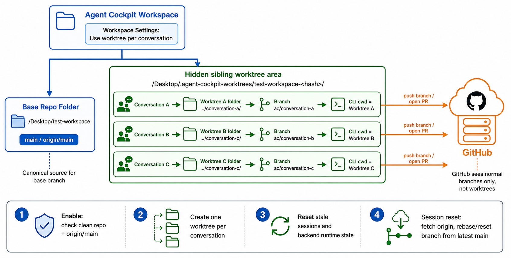

# Worktree Isolation

Worktree Isolation lets each conversation in a Git-backed workspace run in its
own checkout and session branch. The workspace path you see in the sidebar
stays the same; only the directory the CLI executes in changes per
conversation.

Use it when multiple active conversations in the same repository would
otherwise edit the same files at the same time.



## When To Enable It

Turn worktree isolation on for a workspace when any of these apply:

- You run more than one conversation concurrently against the same repo.
- Two CLI agents would otherwise modify the same files before either branch is
  ready to push.
- You want each conversation to push its own branch and open its own pull
  request without coordinating filesystem writes.

If you only ever run one conversation at a time in a workspace, leave it off.
Worktree isolation adds extra Git directories and session branches that you do
not need in that case.

## Requirements

- The workspace must resolve inside a Git repository. Non-Git workspaces show
  the Worktrees tab as unavailable.
- The base checkout (the original repo folder) must be clean. Uncommitted
  changes block enablement.
- The repo must have a reachable remote and an `origin/main` reference after
  `git fetch origin`. Agent Cockpit uses `origin/main` as the source of truth
  for new session branches.
- No conversation in the workspace may have an active or just-accepted CLI
  turn. Active streams block enable, disable, and reset.

## How To Enable It

1. Open the workspace in Agent Cockpit.
2. Go to Workspace Settings.
3. Select the Worktrees tab.
4. Toggle **Use one worktree per conversation**.
5. Confirm the prompt. Enabling will reset every CLI session in this workspace
   and move every existing conversation to its own worktree.

The Worktrees tab also shows:

- the resolved repo root;
- the base reference (`origin/main`);
- the parent directory Agent Cockpit uses for new worktrees;
- a list of affected conversations with their current execution directory and
  any dirty or missing worktree status;
- any blockers preventing enable or disable.

## What Happens When You Enable It

Enabling worktree isolation does four things in sequence:

1. **Check.** Verify the workspace is in a clean Git repo and `origin/main` is
   reachable. Refuse to enable if any conversation has an in-flight turn.
2. **Create.** Create one Git worktree per existing conversation under a
   hidden sibling directory next to the repo. Each worktree gets a deterministic
   session branch derived from `origin/main`.
3. **Reset.** Archive each conversation's active CLI session and reset
   backend runtime state so cached Codex, Kiro, OpenCode, and Claude Code Interactive
   sessions cannot keep using the pre-isolation checkout.
4. **Route.** Future chat sends, goals, OCR, delivered file previews,
   conversation-scoped Git status and diff, memory capture, and mobile file
   references all use the conversation's worktree as the execution directory.

Example layout for a repo at `~/Desktop/agent-cockpit-workspace`:

```text
~/Desktop/agent-cockpit-workspace/                         # base checkout
~/Desktop/agent-cockpit-worktrees/<workspace-hash>/        # hidden sibling area
  conv-abc123/                                             # worktree for one conversation
  conv-def456/                                             # worktree for another
```

The session branch on each worktree is named like
`ac/<conversation-id>/session-N`, where `N` increments with each session reset
inside that conversation.

## Sessions, Branches, And Pull Requests

Worktrees follow the conversation. Branches follow the session.

- The conversation owns its worktree folder for its entire lifetime. The
  folder is reused across session resets.
- Each session reset runs `git fetch origin` and moves the worktree to a fresh
  branch from `origin/main`. The previous branch stays behind so it can still
  be pushed or opened as a pull request.
- Pull requests are ordinary GitHub branches. GitHub sees normal pushed
  branches; it never sees Agent Cockpit's worktree layout.

This means you can keep iterating in one conversation, reset the session when
you want a fresh start from the latest `main`, and still open pull requests
exactly as you would without worktrees.

## Subdirectory Workspaces

If the workspace is a subdirectory of a Git repository, Agent Cockpit creates
the worktree from the repository root but runs the CLI in the matching
subdirectory inside the worktree. The workspace identity remains the original
subdirectory; only the underlying checkout changes per conversation.

## Disabling Worktree Isolation

The Worktrees tab can also turn isolation off.

Disabling requires:

- no active or preparing CLI turn in any conversation in the workspace;
- a clean base checkout;
- every conversation worktree clean and present on disk.

A clean disable will:

- remove the conversation worktrees;
- clear checkout metadata on each conversation;
- reset affected CLI sessions back to the shared workspace folder;
- return all conversations to executing from the base checkout.

If any worktree is dirty or missing, disable is refused and the Worktrees tab
explains which conversations need attention.

## Limits And Things It Does Not Do

- Worktree isolation does not eliminate merge conflicts. It moves conflicts
  from simultaneous edits in one folder to normal Git merge or pull request
  integration.
- It does not manage development servers per worktree. If you run a local
  server against the base checkout, that server keeps pointing at the base
  checkout regardless of which conversation is active.
- It does not allow two active conversations to share the same session branch.
- It is Git-only. Non-Git workspaces continue to use the shared workspace
  folder.

## Troubleshooting

- **Tab shows Unavailable.** The workspace is not inside a Git repository, or
  Git probing failed. Open the workspace in a terminal and confirm
  `git rev-parse --show-toplevel` reports the expected repo root.
- **Enable is blocked by a dirty base checkout.** Commit, stash, or revert the
  uncommitted changes in the base checkout and try again.
- **Enable is blocked because `origin/main` is missing.** Configure an `origin`
  remote and make sure `main` exists on it, or change the workspace's
  configured base branch to one that is available on `origin`.
- **Disable is blocked by a dirty conversation worktree.** Open that
  conversation's checkout, commit or stash its uncommitted work, then retry.
- **Enable or disable is blocked by an active stream.** Wait for the active
  turn to finish or abort it, then retry.

For the underlying design, see
[ADR-0072](../adr/0072-use-per-conversation-git-worktrees-for-workspace-isolation.md).
